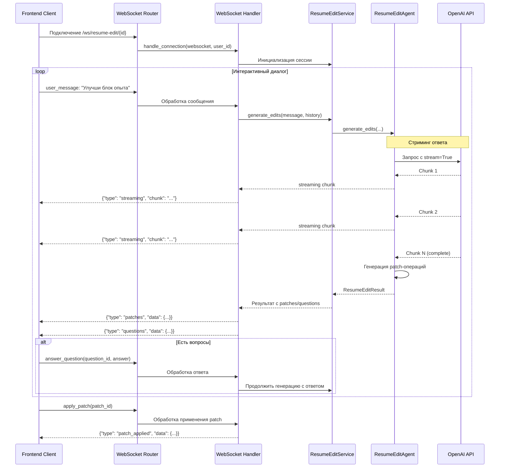

# План: Интерактивное редактирование резюме

## Обзор

Реализация интерактивного редактирования резюме с чат-интерфейсом и предпросмотром правок через WebSocket в реальном времени. Агент генерирует точечные patch-операции (замена/вставка/удаление) вместо переписывания всего резюме, следует правилам из `docs/hh/resume_rules.md` и использует LangChain с инструментами. Все общение происходит через WebSocket с поддержкой стриминга ответов от LLM.

## Архитектура решения

### Формат patch-операций

Гибридный подход: якоря текста с fallback на номера строк.

```python
@dataclass
class ResumeEditPatch:
    type: Literal["replace", "insert", "delete"]
    start_line: int | None  # Fallback
    end_line: int | None    # Fallback
    anchor_before: str | None  # Текст до изменений (для точной привязки)
    anchor_after: str | None   # Текст после изменений
    old_text: str
    new_text: str | None  # None для delete
    reason: str  # Объяснение изменения
```

### Лимиты и валидация

- `max_changed_lines_percent`: 25% (максимум измененных строк)
- `max_patch_items`: 12 (максимум операций за один запрос)
- `min_anchor_length`: 20 символов (минимальная длина якоря для надежности)
- Запрет массовой замены: если user_message про маленький блок, не переписывать большие секции

## Реализация по слоям

### 1. Domain Layer

#### Сущности

**`backend/domain/entities/resume_edit_patch.py`**

- `ResumeEditPatch`: тип операции, якоря/строки, старый/новый текст, причина

**`backend/domain/entities/resume_edit_question.py`**

- `ResumeEditQuestion`: id, текст вопроса, required (обязательный ли)

**`backend/domain/entities/resume_edit_result.py`**

- `ResumeEditResult`: assistant_message, questions[], patches[], warnings[]

#### Порты

**`backend/domain/interfaces/resume_editor_port.py`**

```python
async def generate_edits(
    resume_text: str,
    user_message: str,
    history: list[dict] | None,
    user_id: UUID | None
) -> ResumeEditResult
```

#### Use Cases

**`backend/domain/use_cases/generate_resume_edits.py`**

- Валидация входных данных (размер сообщения, размер истории)
- Вызов `ResumeEditorPort`
- Валидация результата (лимиты на patch)

### 2. Infrastructure Layer

#### LangChain агенты

**`backend/infrastructure/agents/resume_edit/resume_edit_planner_agent.py`**

- Определяет нужные изменения
- Решает, задавать ли уточняющие вопросы
- Использует инструменты для анализа резюме

**`backend/infrastructure/agents/resume_edit/resume_edit_patch_agent.py`**

- Строит patch-операции на основе плана
- Использует инструменты для генерации patch

**`backend/infrastructure/agents/resume_edit/resume_edit_reviewer_agent.py`**

- Проверяет соответствие правилам HH.ru
- Валидация анти-AI гигиены
- Проверка лимитов на изменения

#### Инструменты (Tools) для LangChain

**`backend/infrastructure/agents/resume_edit/tools/extract_sections_tool.py`**

- Выделение секций: "О себе", "Опыт работы", "Навыки", "Образование"

**`backend/infrastructure/agents/resume_edit/tools/rule_check_tool.py`**

- Прогон правил из `docs/hh/resume_rules.md`
- Проверка конкретных правил (тире, метрики, шаблоны)

**`backend/infrastructure/agents/resume_edit/tools/build_patch_tool.py`**

- Генерация line-based и anchor-based patch-операций
- Поиск якорей в тексте резюме

**`backend/infrastructure/agents/resume_edit/tools/validate_patch_tool.py`**

- Проверка лимитов (% измененных строк, количество patch)
- Запрет массовой замены

**`backend/infrastructure/agents/resume_edit/tools/question_generator_tool.py`**

- Генерация уточняющих вопросов про метрики, стек, контекст

#### Оркестратор агентов

**`backend/infrastructure/agents/resume_edit/resume_edit_agent.py`**

- Главный агент, координирует planner -> patch -> reviewer
- Наследуется от `BaseAgent` для логирования LLM вызовов
- Реализует `ResumeEditorPort`
- Поддерживает стриминг ответов (streaming=True в вызовах LLM)
- Отправляет chunks через callback для WebSocket

#### Общие промпты

**`backend/infrastructure/agents/prompts/resume_rules.md`**

- Вынести правила из `docs/hh/resume_rules.md` в общий источник
- Использовать в `ResumeEvaluatorAgent` и новых агентах редактирования

### 3. Application Layer

**`backend/application/services/resume_edit_service.py`**

- Загружает резюме через `GetResumeUseCase`
- Обрабатывает WebSocket соединение для редактирования резюме
- Управляет сессией редактирования (история диалога, состояние)
- Вызывает `GenerateResumeEditsUseCase` и отправляет результаты через WebSocket
- Поддерживает стриминг ответов от LLM (streaming chunks)

**`backend/application/services/resume_edit_websocket_handler.py`**

- Обработчик WebSocket соединения для редактирования резюме
- Принимает сообщения от клиента
- Координирует работу с `ResumeEditService`
- Отправляет ответы через WebSocket (обычные и стриминг)

### 4. Presentation Layer

#### WebSocket Router

**`backend/presentation/routers/resume_edit_websocket_router.py`**

- Новый WebSocket endpoint: `/ws/resume-edit/{resume_id}`
- Аутентификация через JWT токен в query параметре (как в существующем `/ws`)
- Обработка двусторонней коммуникации:
  - Клиент -> Сервер: сообщения пользователя, ответы на вопросы, применение/отклонение patch
  - Сервер -> Клиент: ответы агента, вопросы, patch-операции, стриминг прогресса LLM

#### Формат WebSocket сообщений

**Сообщения от клиента:**

```json
{
  "type": "user_message",
  "data": {
    "message": "Улучши блок опыта в компании X",
    "resume_text": "...",  // опционально, если не передан - загружается с бэка
    "history": [...]  // опционально, история диалога
  }
}
```
```json
{
  "type": "answer_question",
  "data": {
    "question_id": "uuid",
    "answer": "ответ пользователя"
  }
}
```
```json
{
  "type": "apply_patch",
  "data": {
    "patch_id": "uuid"
  }
}
```

**Сообщения от сервера:**

```json
{
  "type": "assistant_message",
  "data": {
    "message": "Я проанализировал резюме и подготовил изменения..."
  }
}
```
```json
{
  "type": "questions",
  "data": {
    "questions": [
      {"id": "uuid", "text": "Какой процент улучшения?", "required": true}
    ]
  }
}
```
```json
{
  "type": "patches",
  "data": {
    "patches": [
      {
        "id": "uuid",
        "type": "replace",
        "start_line": 10,
        "end_line": 12,
        "anchor_before": "...",
        "old_text": "...",
        "new_text": "...",
        "reason": "..."
      }
    ]
  }
}
```
```json
{
  "type": "streaming",
  "data": {
    "chunk": "часть ответа от LLM",
    "is_complete": false
  }
}
```
```json
{
  "type": "error",
  "data": {
    "message": "Ошибка при обработке запроса"
  }
}
```

#### DTO

**`backend/presentation/dto/resume_edit_request.py`**

- message: str
- resume_text: str | None (опционально, если не передан - загружается с бэка)
- history: list[dict] | None

**`backend/presentation/dto/resume_edit_patch_response.py`**

- type, start_line, end_line, anchor_before, anchor_after, old_text, new_text, reason

**`backend/presentation/dto/resume_edit_question_response.py`**

- id, text, required

**`backend/presentation/dto/resume_edit_result_response.py`**

- assistant_message, questions[], patches[], warnings[]

### 5. Frontend Layer

#### Новая страница

**`frontend/src/pages/ResumeEditPage.tsx`**

- Layout: слева чат, справа резюме с подсветкой изменений
- Чат: лента сообщений (user/assistant/question/system)
- Резюме: diff view с подсветкой изменений
- Кнопки: "Применить", "Отклонить", "Сохранить (локально)", "Отменить последнее", "Сбросить все"

#### Компоненты

**`frontend/src/components/ResumeEditChat.tsx`**

- Чат-интерфейс с историей сообщений
- Отображение вопросов агента с возможностью ответа
- Поле ввода сообщения
- Отображение стриминга ответов от LLM (показ прогресса генерации)
- Индикатор подключения к WebSocket

**`frontend/src/components/ResumeEditPreview.tsx`**

- Предпросмотр резюме с подсветкой изменений
- Diff view: удаления (красный), вставки (зеленый), замены (желтый)
- Маркеры строк с изменениями

**`frontend/src/components/ResumeEditPatchesPanel.tsx`**

- Список patch-операций
- Возможность применить/отклонить отдельные patch

#### Store (Zustand)

**`frontend/src/stores/resumeEditStore.ts`**

- Состояние: original_resume_text, current_resume_text, applied_patches[], draft_patches[], chat_history[], websocket_connected, streaming_message
- Действия: apply_patch, reject_patch, reset_all, save_draft, send_message, answer_question, set_streaming_message
- Интеграция с `ResumeEditWebSocketClient` для отправки сообщений

#### WebSocket клиент для редактирования

**`frontend/src/api/resumeEditWebSocket.ts`**

- Класс `ResumeEditWebSocketClient` для управления WebSocket соединением
- Методы: `connect(resumeId)`, `sendMessage(message, resumeText, history)`, `answerQuestion(questionId, answer)`, `applyPatch(patchId)`, `disconnect()`
- Обработка событий: `onMessage`, `onQuestions`, `onPatches`, `onStreaming`, `onError`
- Автоматическое переподключение при разрыве соединения

#### Обновление роутинга

**`frontend/src/App.tsx`**

- Добавить роут `/resumes/:resumeId/edit`

#### Обновление ResumeDetailPage

**`frontend/src/pages/ResumeDetailPage.tsx`**

- Добавить таб "Редактирование" в существующие табы
- При клике на таб - переход на `/resumes/:resumeId/edit`

## Последовательность реализации

### Итерация 1: Domain и Infrastructure (базовая структура)

1. Создать сущности: `ResumeEditPatch`, `ResumeEditQuestion`, `ResumeEditResult`
2. Создать порт `ResumeEditorPort`
3. Создать use case `GenerateResumeEditsUseCase`
4. Вынести правила в `infrastructure/agents/prompts/resume_rules.md`
5. Создать базовую структуру LangChain агентов (planner, patch, reviewer)
6. Реализовать инструменты: `extract_sections`, `rule_check`, `build_patch`, `validate_patch`, `question_generator`
7. Создать главный агент `ResumeEditAgent` с оркестрацией

### Итерация 2: Application и Presentation (WebSocket)

1. Создать `ResumeEditService` с поддержкой стриминга
2. Создать `ResumeEditWebSocketHandler` для обработки WebSocket соединений
3. Создать WebSocket router `resume_edit_websocket_router.py` с endpoint `/ws/resume-edit/{resume_id}`
4. Реализовать формат сообщений WebSocket (JSON с типами)
5. Добавить dependency injection для сервисов
6. Интегрировать стриминг ответов от LLM через WebSocket

### Итерация 3: Frontend (базовый UI и WebSocket)

1. Создать `ResumeEditWebSocketClient` для управления WebSocket соединением
2. Создать `ResumeEditPage` с layout (чат + preview)
3. Создать компоненты: `ResumeEditChat`, `ResumeEditPreview`, `ResumeEditPatchesPanel`
4. Создать store `resumeEditStore` с интеграцией WebSocket
5. Реализовать обработку WebSocket сообщений (assistant_message, questions, patches, streaming, error)
6. Добавить роут в `App.tsx`
7. Добавить таб "Редактирование" в `ResumeDetailPage`

### Итерация 4: Frontend (diff view, интерактивность и стриминг)

1. Реализовать diff view с подсветкой изменений
2. Реализовать применение/отклонение patch через WebSocket
3. Реализовать отображение стриминга ответов от LLM (показ прогресса)
4. Реализовать локальное сохранение состояния
5. Добавить кнопки управления (отменить, сбросить)
6. Добавить индикатор подключения к WebSocket и обработку переподключения

### Итерация 5: Полировка и тесты

1. Юнит-тесты: patch apply/rollback, validate_patch
2. Интеграционные тесты: use case -> port mock
3. Фронтенд: snapshot/interaction тесты для diff панели
4. Обработка ошибок и edge cases

## Архитектура WebSocket коммуникации

### Поток данных



### Управление сессиями

- Каждое WebSocket соединение = одна сессия редактирования
- Сессия хранит: resume_id, user_id, chat_history, current_resume_text
- При разрыве соединения сессия теряется (в MVP), в будущем можно сохранять в БД

### Стриминг ответов от LLM

- Использовать `stream=True` в вызовах OpenAI API
- Отправлять chunks через WebSocket по мере получения
- На фронте собирать chunks в полное сообщение
- Показывать индикатор "Агент печатает..." во время стриминга

## Технические детали

### LangChain интеграция

- Использовать `langchain` и `langchain-openai` для создания агентов
- Структура агентов: `AgentExecutor` с набором инструментов
- Промпты: использовать шаблоны из `infrastructure/agents/prompts/`
- Логирование: через `BaseAgent._log_llm_call()` для каждого вызова LLM
- Стриминг: использовать `stream=True` в вызовах LLM и отправлять chunks через WebSocket callback

### Применение patch на фронте

Алгоритм применения patch:

1. Найти якорь в тексте (anchor_before/anchor_after)
2. Если якорь не найден - использовать fallback на номера строк
3. Применить операцию (replace/insert/delete)
4. Обновить состояние в store
5. Пересчитать номера строк для следующих patch

### Валидация patch

- Проверка лимитов перед применением
- Валидация якорей (должны существовать в тексте)
- Проверка на конфликты между patch (пересекающиеся диапазоны)

## Файлы для создания/изменения

### Новые файлы

- `backend/domain/entities/resume_edit_patch.py`
- `backend/domain/entities/resume_edit_question.py`
- `backend/domain/entities/resume_edit_result.py`
- `backend/domain/interfaces/resume_editor_port.py`
- `backend/domain/use_cases/generate_resume_edits.py`
- `backend/infrastructure/agents/resume_edit/__init__.py`
- `backend/infrastructure/agents/resume_edit/resume_edit_agent.py`
- `backend/infrastructure/agents/resume_edit/resume_edit_planner_agent.py`
- `backend/infrastructure/agents/resume_edit/resume_edit_patch_agent.py`
- `backend/infrastructure/agents/resume_edit/resume_edit_reviewer_agent.py`
- `backend/infrastructure/agents/resume_edit/tools/__init__.py`
- `backend/infrastructure/agents/resume_edit/tools/extract_sections_tool.py`
- `backend/infrastructure/agents/resume_edit/tools/rule_check_tool.py`
- `backend/infrastructure/agents/resume_edit/tools/build_patch_tool.py`
- `backend/infrastructure/agents/resume_edit/tools/validate_patch_tool.py`
- `backend/infrastructure/agents/resume_edit/tools/question_generator_tool.py`
- `backend/infrastructure/agents/prompts/resume_rules.md`
- `backend/application/services/resume_edit_service.py`
- `backend/application/services/resume_edit_websocket_handler.py`
- `backend/presentation/routers/resume_edit_websocket_router.py`
- `frontend/src/pages/ResumeEditPage.tsx`
- `frontend/src/components/ResumeEditChat.tsx`
- `frontend/src/components/ResumeEditPreview.tsx`
- `frontend/src/components/ResumeEditPatchesPanel.tsx`
- `frontend/src/stores/resumeEditStore.ts`
- `frontend/src/api/resumeEditWebSocket.ts`

### Изменяемые файлы

- `backend/presentation/app.py` (зарегистрировать новый WebSocket router)
- `backend/presentation/dependencies.py` (добавить DI для сервисов)
- `frontend/src/App.tsx` (добавить роут)
- `frontend/src/pages/ResumeDetailPage.tsx` (добавить таб)
- `backend/infrastructure/agents/resume_evaluator_agent.py` (использовать общие правила из prompts/)

## Зависимости

- Добавить `langchain` и `langchain-openai` в `backend/requirements.txt`
- Убедиться, что версии совместимы с текущим Python (3.11+)

## Риски и митигация

1. **Стабильность привязки patch к строкам**: Гибридный подход (якоря + fallback) решает проблему
2. **Ограничение переписывания**: Валидация через `validate_patch_tool` с лимитом 25%
3. **История диалога**: Пока хранится на фронте, в будущем можно добавить сервис/БД
4. **Выделение секций**: Инструмент `extract_sections_tool` с обработкой edge cases
5. **Шаблонные формулировки**: Проверка через `rule_check_tool` с базой известных шаблонов
6. **WebSocket соединение**: Автоматическое переподключение при разрыве, обработка ошибок, таймауты
7. **Стриминг LLM**: Обработка частичных ответов, корректное отображение прогресса, обработка ошибок стриминга
8. **Множественные соединения**: Один пользователь может иметь несколько вкладок - нужно управлять сессиями редактирования