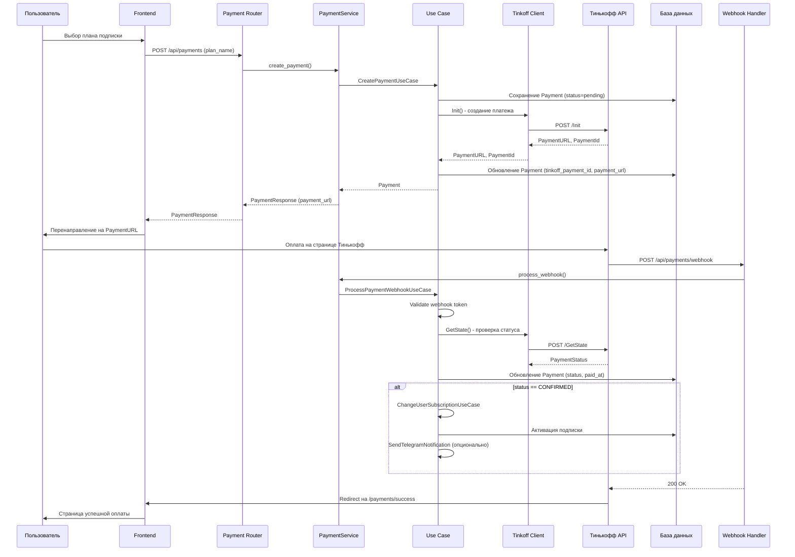

# План подключения Тинькофф эквайринга

## Обзор

Интеграция Тинькофф эквайринга для обработки платежей за подписки. Реализация включает:

- Backend: клиент API, domain entities, use cases, сервис, роутер, миграции
- Frontend: страницы оплаты, истории платежей, админка
- Интеграция с существующей системой подписок

## Архитектура решения (Clean Architecture)

```
┌─────────────────────────────────────────────────────────────────┐
│                     PRESENTATION LAYER                          │
│  ┌─────────────────┐  ┌─────────────────┐  ┌─────────────────┐  │
│  │ payment_router  │  │  admin_router   │  │   Frontend      │  │
│  │ (user endpoints)│  │ (admin endpoints)│  │   (React)       │  │
│  └────────┬────────┘  └────────┬────────┘  └────────┬────────┘  │
└───────────┼─────────────────────┼─────────────────────┼─────────┘
            │                     │                     │
┌───────────┼─────────────────────┼─────────────────────┼─────────┐
│           ▼                     ▼           APPLICATION LAYER   │
│  ┌──────────────────────────────────────────────────────────┐   │
│  │                    PaymentService                         │   │
│  │  (оркестрация use cases, DI, транзакции)                 │   │
│  └──────────────────────────────────────────────────────────┘   │
└─────────────────────────────────┬───────────────────────────────┘
                                  │
┌─────────────────────────────────┼───────────────────────────────┐
│                                 ▼              DOMAIN LAYER     │
│  ┌────────────────┐  ┌─────────────────────┐  ┌──────────────┐  │
│  │ Payment Entity │  │     Use Cases       │  │  Exceptions  │  │
│  │ PaymentStatus  │  │ - CreatePayment     │  │ - PaymentNot │  │
│  │                │  │ - ProcessWebhook    │  │   FoundError │  │
│  │                │  │ - GetPayment        │  │ - TinkoffApi │  │
│  │                │  │ - GetUserPayments   │  │   Error      │  │
│  │                │  │ - CancelPayment     │  │ - Webhook    │  │
│  │                │  │ - Admin: List/Stats │  │   Validation │  │
│  └────────────────┘  └─────────────────────┘  └──────────────┘  │
│                                                                  │
│  ┌──────────────────────────────────────────────────────────┐   │
│  │              PaymentRepositoryPort (interface)            │   │
│  └──────────────────────────────────────────────────────────┘   │
└─────────────────────────────────┬───────────────────────────────┘
                                  │
┌─────────────────────────────────┼───────────────────────────────┐
│                                 ▼        INFRASTRUCTURE LAYER   │
│  ┌────────────────┐  ┌─────────────────────┐  ┌──────────────┐  │
│  │ PaymentModel   │  │  PaymentRepository  │  │ Tinkoff      │  │
│  │ (SQLAlchemy)   │  │  (implementation)   │  │ Acquiring    │  │
│  │                │  │                     │  │ Client       │  │
│  └────────────────┘  └─────────────────────┘  └──────────────┘  │
│                                                                  │
│  ┌──────────────────────────────────────────────────────────┐   │
│  │                      UnitOfWork                           │   │
│  │               (+ payment_repository)                      │   │
│  └──────────────────────────────────────────────────────────┘   │
└─────────────────────────────────────────────────────────────────┘
```

## Поток данных



---

## Детальный план реализации

---

## ЧАСТЬ 1: BACKEND

---

### 1. Конфигурация

**Файл:** `backend/config.py`

Добавить dataclass `TinkoffAcquiringConfig`:

```python
@dataclass
class TinkoffAcquiringConfig:
    terminal_key: str          # TerminalKey из личного кабинета Тинькофф
    secret_key: str            # SecretKey для подписи запросов
    base_url: str              # URL API (тестовый/продакшн)
    is_test: bool = True       # Флаг тестового режима
    success_url: str = ""      # URL редиректа при успехе
    fail_url: str = ""         # URL редиректа при ошибке
```

Добавить в `AppConfig`:

```python
tinkoff: TinkoffAcquiringConfig
```

**Переменные окружения:**

```
TINKOFF_TERMINAL_KEY=your_terminal_key
TINKOFF_SECRET_KEY=your_secret_key
TINKOFF_IS_TEST=true
TINKOFF_BASE_URL=https://securepay.tinkoff.ru/v2
TINKOFF_SUCCESS_URL=https://yourdomain.com/payments/success
TINKOFF_FAIL_URL=https://yourdomain.com/payments/fail
```

---

### 2. Domain Exceptions

**Файл:** `backend/domain/exceptions/payment_exceptions.py`

```python
class PaymentError(Exception):
    """Базовый класс для ошибок платежей."""
    pass

class PaymentNotFoundError(PaymentError):
    """Платеж не найден."""
    def __init__(self, payment_id: str):
        self.payment_id = payment_id
        super().__init__(f"Платеж {payment_id} не найден")

class PaymentAlreadyProcessedError(PaymentError):
    """Платеж уже обработан."""
    def __init__(self, payment_id: str, status: str):
        self.payment_id = payment_id
        self.status = status
        super().__init__(f"Платеж {payment_id} уже обработан, статус: {status}")

class PaymentCancellationError(PaymentError):
    """Невозможно отменить платеж."""
    def __init__(self, payment_id: str, reason: str):
        super().__init__(f"Невозможно отменить платеж {payment_id}: {reason}")

class TinkoffApiError(PaymentError):
    """Ошибка API Тинькофф."""
    def __init__(self, error_code: str, message: str, details: dict | None = None):
        self.error_code = error_code
        self.details = details
        super().__init__(f"Ошибка Тинькофф API [{error_code}]: {message}")

class WebhookValidationError(PaymentError):
    """Ошибка валидации webhook."""
    def __init__(self, reason: str):
        super().__init__(f"Невалидный webhook: {reason}")
```

---

### 3. Доменная сущность

**Файл:** `backend/domain/entities/payment.py`

```python
from __future__ import annotations
from dataclasses import dataclass
from datetime import datetime
from decimal import Decimal
from enum import Enum
from uuid import UUID


class PaymentStatus(str, Enum):
    """Статусы платежа."""
    PENDING = "pending"           # Создан, ожидает оплаты
    CONFIRMED = "confirmed"       # Успешно оплачен
    CANCELED = "canceled"         # Отменен пользователем
    REJECTED = "rejected"         # Отклонен (ошибка оплаты)
    REFUNDED = "refunded"         # Возврат средств


@dataclass
class Payment:
    """Доменная сущность платежа."""
    id: UUID
    user_id: UUID
    subscription_plan_id: UUID
    amount: Decimal
    currency: str = "RUB"
    status: PaymentStatus = PaymentStatus.PENDING
    tinkoff_payment_id: str | None = None
    payment_url: str | None = None
    description: str | None = None
    created_at: datetime | None = None
    paid_at: datetime | None = None

    @property
    def is_pending(self) -> bool:
        return self.status == PaymentStatus.PENDING

    @property
    def is_confirmed(self) -> bool:
        return self.status == PaymentStatus.CONFIRMED

    @property
    def can_be_canceled(self) -> bool:
        return self.status == PaymentStatus.PENDING
```

---

### 4. Интерфейс репозитория

**Файл:** `backend/domain/interfaces/payment_repository_port.py`

```python
from __future__ import annotations
from abc import ABC, abstractmethod
from datetime import datetime
from uuid import UUID

from domain.entities.payment import Payment, PaymentStatus


class PaymentRepositoryPort(ABC):
    """Порт репозитория платежей."""

    @abstractmethod
    async def get_by_id(self, payment_id: UUID) -> Payment | None:
        """Получить платеж по ID."""

    @abstractmethod
    async def get_by_tinkoff_id(self, tinkoff_payment_id: str) -> Payment | None:
        """Получить платеж по ID из Тинькофф."""

    @abstractmethod
    async def create(self, payment: Payment) -> Payment:
        """Создать новый платеж."""

    @abstractmethod
    async def update(self, payment: Payment) -> Payment:
        """Обновить платеж."""

    @abstractmethod
    async def get_by_user_id(
        self,
        user_id: UUID,
        limit: int = 50,
        offset: int = 0
    ) -> list[Payment]:
        """Получить платежи пользователя."""

    @abstractmethod
    async def get_all_paginated(
        self,
        limit: int = 50,
        offset: int = 0,
        status: PaymentStatus | None = None,
        user_id: UUID | None = None,
        date_from: datetime | None = None,
        date_to: datetime | None = None,
    ) -> tuple[list[Payment], int]:
        """Получить все платежи с пагинацией и фильтрацией. Возвращает (payments, total_count)."""

    @abstractmethod
    async def get_metrics(
        self,
        date_from: datetime | None = None,
        date_to: datetime | None = None,
    ) -> dict:
        """Получить метрики платежей (total_amount, count, by_status)."""
```

---

### 5. SQLAlchemy модель

**Файл:** `backend/infrastructure/database/models/payment_model.py`

```python
from datetime import datetime
from decimal import Decimal
from uuid import UUID

from sqlalchemy import (
    Column, DateTime, Enum, ForeignKey, Index,
    Numeric, String, Text, func
)
from sqlalchemy.dialects.postgresql import UUID as PG_UUID
from sqlalchemy.orm import relationship

from domain.entities.payment import PaymentStatus
from infrastructure.database.models.base import Base


class PaymentModel(Base):
    """SQLAlchemy модель платежа."""

    __tablename__ = "payments"

    id = Column(PG_UUID(as_uuid=True), primary_key=True)
    user_id = Column(
        PG_UUID(as_uuid=True),
        ForeignKey("users.id", ondelete="CASCADE"),
        nullable=False
    )
    subscription_plan_id = Column(
        PG_UUID(as_uuid=True),
        ForeignKey("subscription_plans.id", ondelete="RESTRICT"),
        nullable=False
    )
    tinkoff_payment_id = Column(String(255), unique=True, nullable=True)
    payment_url = Column(Text, nullable=True)
    amount = Column(Numeric(10, 2), nullable=False)
    currency = Column(String(3), nullable=False, default="RUB")
    status = Column(
        Enum(PaymentStatus, name="payment_status"),
        nullable=False,
        default=PaymentStatus.PENDING
    )
    description = Column(Text, nullable=True)
    created_at = Column(
        DateTime(timezone=True),
        nullable=False,
        server_default=func.now()
    )
    paid_at = Column(DateTime(timezone=True), nullable=True)

    # Relationships
    user = relationship("UserModel", back_populates="payments")
    subscription_plan = relationship("SubscriptionPlanModel")

    __table_args__ = (
        Index("ix_payments_user_id", "user_id"),
        Index("ix_payments_tinkoff_payment_id", "tinkoff_payment_id"),
        Index("ix_payments_status", "status"),
        Index("ix_payments_created_at", "created_at"),
    )
```

**Миграция:** `backend/alembic/versions/XXXX_add_payments_table.py`

```python
def upgrade():
    # Создать enum type
    payment_status = postgresql.ENUM(
        'pending', 'confirmed', 'canceled', 'rejected', 'refunded',
        name='payment_status'
    )
    payment_status.create(op.get_bind())

    op.create_table(
        'payments',
        sa.Column('id', postgresql.UUID(as_uuid=True), primary_key=True),
        sa.Column('user_id', postgresql.UUID(as_uuid=True),
                  sa.ForeignKey('users.id', ondelete='CASCADE'), nullable=False),
        sa.Column('subscription_plan_id', postgresql.UUID(as_uuid=True),
                  sa.ForeignKey('subscription_plans.id', ondelete='RESTRICT'), nullable=False),
        sa.Column('tinkoff_payment_id', sa.String(255), unique=True, nullable=True),
        sa.Column('payment_url', sa.Text, nullable=True),
        sa.Column('amount', sa.Numeric(10, 2), nullable=False),
        sa.Column('currency', sa.String(3), nullable=False, server_default='RUB'),
        sa.Column('status', payment_status, nullable=False, server_default='pending'),
        sa.Column('description', sa.Text, nullable=True),
        sa.Column('created_at', sa.DateTime(timezone=True), nullable=False,
                  server_default=sa.func.now()),
        sa.Column('paid_at', sa.DateTime(timezone=True), nullable=True),
    )

    op.create_index('ix_payments_user_id', 'payments', ['user_id'])
    op.create_index('ix_payments_tinkoff_payment_id', 'payments', ['tinkoff_payment_id'])
    op.create_index('ix_payments_status', 'payments', ['status'])
    op.create_index('ix_payments_created_at', 'payments', ['created_at'])

def downgrade():
    op.drop_table('payments')
    op.execute('DROP TYPE payment_status')
```

**Не забыть:** Добавить `payments = relationship("PaymentModel", back_populates="user")` в `UserModel`.

---

### 6. Реализация репозитория

**Файл:** `backend/infrastructure/database/repositories/payment_repository.py`

```python
from datetime import datetime
from decimal import Decimal
from uuid import UUID

from sqlalchemy import func, select
from sqlalchemy.ext.asyncio import AsyncSession

from domain.entities.payment import Payment, PaymentStatus
from domain.interfaces.payment_repository_port import PaymentRepositoryPort
from infrastructure.database.models.payment_model import PaymentModel


class PaymentRepository(PaymentRepositoryPort):
    """Реализация репозитория платежей."""

    def __init__(self, session: AsyncSession):
        self._session = session

    def _to_domain(self, model: PaymentModel) -> Payment:
        return Payment(
            id=model.id,
            user_id=model.user_id,
            subscription_plan_id=model.subscription_plan_id,
            tinkoff_payment_id=model.tinkoff_payment_id,
            payment_url=model.payment_url,
            amount=model.amount,
            currency=model.currency,
            status=model.status,
            description=model.description,
            created_at=model.created_at,
            paid_at=model.paid_at,
        )

    def _to_model(self, entity: Payment) -> PaymentModel:
        return PaymentModel(
            id=entity.id,
            user_id=entity.user_id,
            subscription_plan_id=entity.subscription_plan_id,
            tinkoff_payment_id=entity.tinkoff_payment_id,
            payment_url=entity.payment_url,
            amount=entity.amount,
            currency=entity.currency,
            status=entity.status,
            description=entity.description,
            created_at=entity.created_at,
            paid_at=entity.paid_at,
        )

    async def get_by_id(self, payment_id: UUID) -> Payment | None:
        result = await self._session.execute(
            select(PaymentModel).where(PaymentModel.id == payment_id)
        )
        model = result.scalar_one_or_none()
        return self._to_domain(model) if model else None

    async def get_by_tinkoff_id(self, tinkoff_payment_id: str) -> Payment | None:
        result = await self._session.execute(
            select(PaymentModel).where(
                PaymentModel.tinkoff_payment_id == tinkoff_payment_id
            )
        )
        model = result.scalar_one_or_none()
        return self._to_domain(model) if model else None

    async def create(self, payment: Payment) -> Payment:
        model = self._to_model(payment)
        self._session.add(model)
        await self._session.flush()
        await self._session.refresh(model)
        return self._to_domain(model)

    async def update(self, payment: Payment) -> Payment:
        result = await self._session.execute(
            select(PaymentModel).where(PaymentModel.id == payment.id)
        )
        model = result.scalar_one()
        model.tinkoff_payment_id = payment.tinkoff_payment_id
        model.payment_url = payment.payment_url
        model.status = payment.status
        model.paid_at = payment.paid_at
        await self._session.flush()
        await self._session.refresh(model)
        return self._to_domain(model)

    async def get_by_user_id(
        self, user_id: UUID, limit: int = 50, offset: int = 0
    ) -> list[Payment]:
        result = await self._session.execute(
            select(PaymentModel)
            .where(PaymentModel.user_id == user_id)
            .order_by(PaymentModel.created_at.desc())
            .limit(limit)
            .offset(offset)
        )
        return [self._to_domain(m) for m in result.scalars().all()]

    async def get_all_paginated(
        self,
        limit: int = 50,
        offset: int = 0,
        status: PaymentStatus | None = None,
        user_id: UUID | None = None,
        date_from: datetime | None = None,
        date_to: datetime | None = None,
    ) -> tuple[list[Payment], int]:
        query = select(PaymentModel)
        count_query = select(func.count(PaymentModel.id))

        if status:
            query = query.where(PaymentModel.status == status)
            count_query = count_query.where(PaymentModel.status == status)
        if user_id:
            query = query.where(PaymentModel.user_id == user_id)
            count_query = count_query.where(PaymentModel.user_id == user_id)
        if date_from:
            query = query.where(PaymentModel.created_at >= date_from)
            count_query = count_query.where(PaymentModel.created_at >= date_from)
        if date_to:
            query = query.where(PaymentModel.created_at <= date_to)
            count_query = count_query.where(PaymentModel.created_at <= date_to)

        query = query.order_by(PaymentModel.created_at.desc()).limit(limit).offset(offset)

        result = await self._session.execute(query)
        count_result = await self._session.execute(count_query)

        payments = [self._to_domain(m) for m in result.scalars().all()]
        total = count_result.scalar() or 0

        return payments, total

    async def get_metrics(
        self,
        date_from: datetime | None = None,
        date_to: datetime | None = None,
    ) -> dict:
        # Базовый фильтр по датам
        filters = []
        if date_from:
            filters.append(PaymentModel.created_at >= date_from)
        if date_to:
            filters.append(PaymentModel.created_at <= date_to)

        # Общая сумма и количество подтвержденных платежей
        confirmed_query = select(
            func.count(PaymentModel.id).label("count"),
            func.coalesce(func.sum(PaymentModel.amount), 0).label("total")
        ).where(
            PaymentModel.status == PaymentStatus.CONFIRMED,
            *filters
        )

        confirmed_result = await self._session.execute(confirmed_query)
        confirmed = confirmed_result.one()

        # Количество по статусам
        status_query = select(
            PaymentModel.status,
            func.count(PaymentModel.id).label("count")
        ).where(*filters).group_by(PaymentModel.status)

        status_result = await self._session.execute(status_query)
        by_status = {row.status.value: row.count for row in status_result.all()}

        return {
            "total_amount": float(confirmed.total),
            "confirmed_count": confirmed.count,
            "by_status": by_status,
        }
```

---

### 7. Интеграция в UnitOfWork

**Файл:** `backend/domain/interfaces/unit_of_work_port.py`

Добавить:

```python
from domain.interfaces.payment_repository_port import PaymentRepositoryPort

# В класс UnitOfWorkPort:
@property
@abstractmethod
def payment_repository(self) -> PaymentRepositoryPort:
    """Получить репозиторий платежей."""
```

**Файл:** `backend/infrastructure/database/unit_of_work.py`

Добавить:

```python
from domain.interfaces.payment_repository_port import PaymentRepositoryPort
from infrastructure.database.repositories.payment_repository import PaymentRepository

# В класс UnitOfWork:
_payment_repository: PaymentRepositoryPort | None = None

@property
def payment_repository(self) -> PaymentRepositoryPort:
    if self._payment_repository is None:
        self._payment_repository = PaymentRepository(self._session)
    return self._payment_repository
```

---

### 8. Клиент Тинькофф API

**Файл:** `backend/infrastructure/clients/tinkoff_acquiring_client.py`

```python
from __future__ import annotations

import hashlib
from decimal import Decimal
from typing import Any

import httpx
from loguru import logger

from config import TinkoffAcquiringConfig
from domain.exceptions.payment_exceptions import TinkoffApiError


class TinkoffAcquiringClient:
    """Клиент для работы с API Тинькофф эквайринга."""

    def __init__(self, config: TinkoffAcquiringConfig):
        self._config = config
        self._client = httpx.AsyncClient(
            base_url=config.base_url,
            timeout=30.0,
        )

    def _generate_token(self, data: dict[str, Any]) -> str:
        """Генерация токена для подписи запроса (SHA256).

        Алгоритм:
        1. Добавить Password (SecretKey) в данные
        2. Отсортировать по ключам
        3. Конкатенировать значения
        4. Вычислить SHA256
        """
        token_data = {**data, "Password": self._config.secret_key}
        # Убрать вложенные объекты и массивы
        token_data = {
            k: v for k, v in token_data.items()
            if not isinstance(v, (dict, list))
        }
        sorted_values = "".join(
            str(v) for k, v in sorted(token_data.items())
        )
        return hashlib.sha256(sorted_values.encode()).hexdigest()

    def validate_webhook_token(self, data: dict[str, Any]) -> bool:
        """Валидация токена из webhook."""
        received_token = data.pop("Token", None)
        if not received_token:
            return False
        expected_token = self._generate_token(data)
        return received_token.lower() == expected_token.lower()

    async def _make_request(
        self,
        method: str,
        data: dict[str, Any]
    ) -> dict[str, Any]:
        """Выполнить запрос к API."""
        data["TerminalKey"] = self._config.terminal_key
        data["Token"] = self._generate_token(data)

        logger.debug(f"Tinkoff API request: {method}, data: {data}")

        try:
            response = await self._client.post(f"/{method}", json=data)
            response.raise_for_status()
            result = response.json()

            logger.debug(f"Tinkoff API response: {result}")

            if not result.get("Success", False):
                raise TinkoffApiError(
                    error_code=result.get("ErrorCode", "UNKNOWN"),
                    message=result.get("Message", "Unknown error"),
                    details=result,
                )

            return result

        except httpx.HTTPError as e:
            logger.error(f"Tinkoff API HTTP error: {e}")
            raise TinkoffApiError(
                error_code="HTTP_ERROR",
                message=str(e),
            )

    async def init(
        self,
        amount: Decimal,
        order_id: str,
        description: str,
        customer_email: str | None = None,
        customer_phone: str | None = None,
    ) -> dict[str, Any]:
        """Создать платеж.

        Args:
            amount: Сумма в рублях
            order_id: Уникальный ID заказа (наш payment.id)
            description: Описание платежа

        Returns:
            dict с PaymentId и PaymentURL
        """
        data = {
            "Amount": int(amount * 100),  # В копейках
            "OrderId": order_id,
            "Description": description,
            "SuccessURL": self._config.success_url,
            "FailURL": self._config.fail_url,
        }

        if customer_email or customer_phone:
            data["DATA"] = {}
            if customer_email:
                data["DATA"]["Email"] = customer_email
            if customer_phone:
                data["DATA"]["Phone"] = customer_phone

        result = await self._make_request("Init", data)

        return {
            "payment_id": result["PaymentId"],
            "payment_url": result["PaymentURL"],
            "status": result.get("Status"),
        }

    async def get_state(self, payment_id: str) -> dict[str, Any]:
        """Получить состояние платежа.

        Args:
            payment_id: ID платежа в Тинькофф

        Returns:
            dict со статусом платежа
        """
        result = await self._make_request("GetState", {"PaymentId": payment_id})

        return {
            "payment_id": result["PaymentId"],
            "status": result["Status"],
            "amount": Decimal(result["Amount"]) / 100,
        }

    async def cancel(
        self,
        payment_id: str,
        amount: Decimal | None = None
    ) -> dict[str, Any]:
        """Отменить платеж.

        Args:
            payment_id: ID платежа в Тинькофф
            amount: Сумма отмены (если частичная)
        """
        data = {"PaymentId": payment_id}
        if amount:
            data["Amount"] = int(amount * 100)

        result = await self._make_request("Cancel", data)

        return {
            "payment_id": result["PaymentId"],
            "status": result["Status"],
        }

    async def close(self):
        """Закрыть HTTP клиент."""
        await self._client.aclose()
```

---

### 9. Use Cases

#### 9.1 CreatePaymentUseCase

**Файл:** `backend/domain/use_cases/payments/create_payment.py`

```python
from __future__ import annotations

from datetime import datetime, timezone
from decimal import Decimal
from uuid import UUID, uuid4

from loguru import logger

from domain.entities.payment import Payment, PaymentStatus
from domain.exceptions.payment_exceptions import PaymentError
from domain.interfaces.unit_of_work_port import UnitOfWorkPort
from infrastructure.clients.tinkoff_acquiring_client import TinkoffAcquiringClient


class CreatePaymentUseCase:
    """Use case для создания платежа."""

    def __init__(
        self,
        uow: UnitOfWorkPort,
        tinkoff_client: TinkoffAcquiringClient,
    ):
        self._uow = uow
        self._tinkoff_client = tinkoff_client

    async def execute(
        self,
        user_id: UUID,
        plan_name: str,
        customer_email: str | None = None,
    ) -> Payment:
        """Создать платеж для подписки.

        Args:
            user_id: ID пользователя
            plan_name: Название плана (PLAN_1, PLAN_2, PLAN_3)
            customer_email: Email для чека (опционально)

        Returns:
            Payment с payment_url для редиректа
        """
        # Получить план подписки
        plan = await self._uow.subscription_plan_repository.get_by_name(plan_name)
        if plan is None:
            raise ValueError(f"План подписки '{plan_name}' не найден")

        if plan.price is None or plan.price <= 0:
            raise ValueError(f"План '{plan_name}' бесплатный, оплата не требуется")

        # Создать доменную сущность
        payment = Payment(
            id=uuid4(),
            user_id=user_id,
            subscription_plan_id=plan.id,
            amount=Decimal(str(plan.price)),
            currency="RUB",
            status=PaymentStatus.PENDING,
            description=f"Подписка {plan.display_name} на {plan.duration_days} дней",
            created_at=datetime.now(timezone.utc),
        )

        # Сохранить в БД
        payment = await self._uow.payment_repository.create(payment)
        await self._uow.commit()

        logger.info(f"Создан платеж {payment.id} для пользователя {user_id}, план {plan_name}")

        # Инициализировать в Тинькофф
        try:
            tinkoff_result = await self._tinkoff_client.init(
                amount=payment.amount,
                order_id=str(payment.id),
                description=payment.description or "",
                customer_email=customer_email,
            )

            payment.tinkoff_payment_id = tinkoff_result["payment_id"]
            payment.payment_url = tinkoff_result["payment_url"]

            # Обновить с данными от Тинькофф
            payment = await self._uow.payment_repository.update(payment)
            await self._uow.commit()

            logger.info(
                f"Платеж {payment.id} инициализирован в Тинькофф, "
                f"tinkoff_id={payment.tinkoff_payment_id}"
            )

        except Exception as e:
            logger.error(f"Ошибка инициализации платежа в Тинькофф: {e}")
            payment.status = PaymentStatus.REJECTED
            await self._uow.payment_repository.update(payment)
            await self._uow.commit()
            raise PaymentError(f"Не удалось создать платеж: {e}")

        return payment
```

#### 9.2 ProcessPaymentWebhookUseCase

**Файл:** `backend/domain/use_cases/payments/process_payment_webhook.py`

```python
from __future__ import annotations

from datetime import datetime, timezone
from typing import Any
from uuid import UUID

from loguru import logger

from domain.entities.payment import Payment, PaymentStatus
from domain.exceptions.payment_exceptions import (
    PaymentAlreadyProcessedError,
    PaymentNotFoundError,
    WebhookValidationError,
)
from domain.interfaces.unit_of_work_port import UnitOfWorkPort
from domain.use_cases.change_user_subscription import ChangeUserSubscriptionUseCase
from infrastructure.clients.tinkoff_acquiring_client import TinkoffAcquiringClient


# Маппинг статусов Тинькофф -> наши статусы
TINKOFF_STATUS_MAP = {
    "NEW": PaymentStatus.PENDING,
    "FORM_SHOWED": PaymentStatus.PENDING,
    "AUTHORIZING": PaymentStatus.PENDING,
    "3DS_CHECKING": PaymentStatus.PENDING,
    "3DS_CHECKED": PaymentStatus.PENDING,
    "AUTHORIZED": PaymentStatus.PENDING,
    "CONFIRMING": PaymentStatus.PENDING,
    "CONFIRMED": PaymentStatus.CONFIRMED,
    "REVERSING": PaymentStatus.CANCELED,
    "REVERSED": PaymentStatus.CANCELED,
    "REFUNDING": PaymentStatus.REFUNDED,
    "PARTIAL_REFUNDED": PaymentStatus.REFUNDED,
    "REFUNDED": PaymentStatus.REFUNDED,
    "CANCELED": PaymentStatus.CANCELED,
    "REJECTED": PaymentStatus.REJECTED,
}


class ProcessPaymentWebhookUseCase:
    """Use case для обработки webhook от Тинькофф."""

    def __init__(
        self,
        uow: UnitOfWorkPort,
        tinkoff_client: TinkoffAcquiringClient,
        change_subscription_uc: ChangeUserSubscriptionUseCase,
    ):
        self._uow = uow
        self._tinkoff_client = tinkoff_client
        self._change_subscription_uc = change_subscription_uc

    async def execute(self, webhook_data: dict[str, Any]) -> Payment:
        """Обработать webhook от Тинькофф.

        Args:
            webhook_data: Данные из webhook

        Returns:
            Обновленный Payment
        """
        # Валидация токена
        data_copy = webhook_data.copy()
        if not self._tinkoff_client.validate_webhook_token(data_copy):
            logger.warning(f"Невалидный токен webhook: {webhook_data}")
            raise WebhookValidationError("Invalid token")

        order_id = webhook_data.get("OrderId")
        tinkoff_status = webhook_data.get("Status")

        if not order_id or not tinkoff_status:
            raise WebhookValidationError("Missing OrderId or Status")

        # Найти платеж по OrderId (это наш payment.id)
        try:
            payment_id = UUID(order_id)
        except ValueError:
            raise WebhookValidationError(f"Invalid OrderId format: {order_id}")

        payment = await self._uow.payment_repository.get_by_id(payment_id)
        if payment is None:
            raise PaymentNotFoundError(order_id)

        # Проверить, не обработан ли уже
        if payment.status in (PaymentStatus.CONFIRMED, PaymentStatus.REFUNDED):
            logger.info(f"Платеж {payment.id} уже обработан, статус: {payment.status}")
            return payment

        # Маппинг статуса
        new_status = TINKOFF_STATUS_MAP.get(tinkoff_status, PaymentStatus.PENDING)

        logger.info(
            f"Webhook для платежа {payment.id}: "
            f"tinkoff_status={tinkoff_status}, new_status={new_status}"
        )

        # Обновить статус
        old_status = payment.status
        payment.status = new_status

        if new_status == PaymentStatus.CONFIRMED:
            payment.paid_at = datetime.now(timezone.utc)

        payment = await self._uow.payment_repository.update(payment)

        # Если оплата подтверждена - активировать подписку
        if new_status == PaymentStatus.CONFIRMED and old_status != PaymentStatus.CONFIRMED:
            plan = await self._uow.subscription_plan_repository.get_by_id(
                payment.subscription_plan_id
            )
            if plan:
                await self._change_subscription_uc.execute(
                    user_id=payment.user_id,
                    plan_name=plan.name,
                )
                logger.info(
                    f"Подписка активирована для пользователя {payment.user_id}, "
                    f"план: {plan.name}"
                )

        await self._uow.commit()

        return payment
```

#### 9.3 GetPaymentUseCase

**Файл:** `backend/domain/use_cases/payments/get_payment.py`

```python
from __future__ import annotations

from uuid import UUID

from domain.entities.payment import Payment
from domain.exceptions.payment_exceptions import PaymentNotFoundError
from domain.interfaces.payment_repository_port import PaymentRepositoryPort


class GetPaymentUseCase:
    """Use case для получения платежа."""

    def __init__(self, payment_repository: PaymentRepositoryPort):
        self._payment_repository = payment_repository

    async def execute(self, payment_id: UUID, user_id: UUID) -> Payment:
        """Получить платеж по ID с проверкой прав.

        Args:
            payment_id: ID платежа
            user_id: ID пользователя (для проверки прав)

        Returns:
            Payment

        Raises:
            PaymentNotFoundError: Если платеж не найден или не принадлежит пользователю
        """
        payment = await self._payment_repository.get_by_id(payment_id)

        if payment is None or payment.user_id != user_id:
            raise PaymentNotFoundError(str(payment_id))

        return payment
```

#### 9.4 GetUserPaymentsUseCase

**Файл:** `backend/domain/use_cases/payments/get_user_payments.py`

```python
from __future__ import annotations

from uuid import UUID

from domain.entities.payment import Payment
from domain.interfaces.payment_repository_port import PaymentRepositoryPort


class GetUserPaymentsUseCase:
    """Use case для получения истории платежей пользователя."""

    def __init__(self, payment_repository: PaymentRepositoryPort):
        self._payment_repository = payment_repository

    async def execute(
        self,
        user_id: UUID,
        limit: int = 50,
        offset: int = 0
    ) -> list[Payment]:
        """Получить платежи пользователя.

        Args:
            user_id: ID пользователя
            limit: Лимит записей
            offset: Смещение

        Returns:
            Список платежей
        """
        return await self._payment_repository.get_by_user_id(
            user_id=user_id,
            limit=limit,
            offset=offset,
        )
```

#### 9.5 CancelPaymentUseCase

**Файл:** `backend/domain/use_cases/payments/cancel_payment.py`

```python
from __future__ import annotations

from uuid import UUID

from loguru import logger

from domain.entities.payment import Payment, PaymentStatus
from domain.exceptions.payment_exceptions import (
    PaymentCancellationError,
    PaymentNotFoundError,
)
from domain.interfaces.unit_of_work_port import UnitOfWorkPort
from infrastructure.clients.tinkoff_acquiring_client import TinkoffAcquiringClient


class CancelPaymentUseCase:
    """Use case для отмены платежа."""

    def __init__(
        self,
        uow: UnitOfWorkPort,
        tinkoff_client: TinkoffAcquiringClient,
    ):
        self._uow = uow
        self._tinkoff_client = tinkoff_client

    async def execute(self, payment_id: UUID, user_id: UUID) -> Payment:
        """Отменить ожидающий платеж.

        Args:
            payment_id: ID платежа
            user_id: ID пользователя (для проверки прав)

        Returns:
            Обновленный Payment
        """
        payment = await self._uow.payment_repository.get_by_id(payment_id)

        if payment is None or payment.user_id != user_id:
            raise PaymentNotFoundError(str(payment_id))

        if not payment.can_be_canceled:
            raise PaymentCancellationError(
                str(payment_id),
                f"Платеж в статусе {payment.status.value}"
            )

        # Отменить в Тинькофф если есть tinkoff_payment_id
        if payment.tinkoff_payment_id:
            try:
                await self._tinkoff_client.cancel(payment.tinkoff_payment_id)
            except Exception as e:
                logger.warning(f"Не удалось отменить платеж в Тинькофф: {e}")

        payment.status = PaymentStatus.CANCELED
        payment = await self._uow.payment_repository.update(payment)
        await self._uow.commit()

        logger.info(f"Платеж {payment_id} отменен")

        return payment
```

#### 9.6 Admin Use Cases

**Файл:** `backend/domain/use_cases/admin/list_payments_for_admin.py`

```python
from __future__ import annotations

from datetime import datetime
from uuid import UUID

from domain.entities.payment import Payment, PaymentStatus
from domain.interfaces.payment_repository_port import PaymentRepositoryPort


class ListPaymentsForAdminUseCase:
    """Use case для получения списка платежей (админ)."""

    def __init__(self, payment_repository: PaymentRepositoryPort):
        self._payment_repository = payment_repository

    async def execute(
        self,
        limit: int = 50,
        offset: int = 0,
        status: PaymentStatus | None = None,
        user_id: UUID | None = None,
        date_from: datetime | None = None,
        date_to: datetime | None = None,
    ) -> tuple[list[Payment], int]:
        """Получить список платежей с фильтрацией.

        Returns:
            (payments, total_count)
        """
        return await self._payment_repository.get_all_paginated(
            limit=limit,
            offset=offset,
            status=status,
            user_id=user_id,
            date_from=date_from,
            date_to=date_to,
        )
```

**Файл:** `backend/domain/use_cases/admin/get_payment_metrics.py`

```python
from __future__ import annotations

from dataclasses import dataclass
from datetime import datetime
from decimal import Decimal

from domain.interfaces.payment_repository_port import PaymentRepositoryPort


@dataclass
class PaymentMetrics:
    """Метрики платежей."""
    total_amount: Decimal
    confirmed_count: int
    by_status: dict[str, int]
    conversion_rate: float  # confirmed / total


class GetPaymentMetricsUseCase:
    """Use case для получения метрик платежей."""

    def __init__(self, payment_repository: PaymentRepositoryPort):
        self._payment_repository = payment_repository

    async def execute(
        self,
        date_from: datetime | None = None,
        date_to: datetime | None = None,
    ) -> PaymentMetrics:
        """Получить метрики платежей."""
        metrics = await self._payment_repository.get_metrics(
            date_from=date_from,
            date_to=date_to,
        )

        total_count = sum(metrics["by_status"].values())
        conversion_rate = (
            metrics["confirmed_count"] / total_count
            if total_count > 0 else 0.0
        )

        return PaymentMetrics(
            total_amount=Decimal(str(metrics["total_amount"])),
            confirmed_count=metrics["confirmed_count"],
            by_status=metrics["by_status"],
            conversion_rate=conversion_rate,
        )
```

---

### 10. Application Service

**Файл:** `backend/application/services/payment_service.py`

```python
from __future__ import annotations

from datetime import datetime
from uuid import UUID

from loguru import logger

from config import AppConfig
from domain.entities.payment import Payment, PaymentStatus
from domain.use_cases.change_user_subscription import ChangeUserSubscriptionUseCase
from domain.use_cases.payments.cancel_payment import CancelPaymentUseCase
from domain.use_cases.payments.create_payment import CreatePaymentUseCase
from domain.use_cases.payments.get_payment import GetPaymentUseCase
from domain.use_cases.payments.get_user_payments import GetUserPaymentsUseCase
from domain.use_cases.payments.process_payment_webhook import ProcessPaymentWebhookUseCase
from domain.use_cases.admin.list_payments_for_admin import ListPaymentsForAdminUseCase
from domain.use_cases.admin.get_payment_metrics import GetPaymentMetricsUseCase, PaymentMetrics
from infrastructure.clients.tinkoff_acquiring_client import TinkoffAcquiringClient
from infrastructure.database.unit_of_work import UnitOfWork


class PaymentService:
    """Сервис для работы с платежами."""

    def __init__(self, config: AppConfig):
        self._config = config
        self._tinkoff_client = TinkoffAcquiringClient(config.tinkoff)

    async def create_payment(
        self,
        user_id: UUID,
        plan_name: str,
        customer_email: str | None = None,
    ) -> Payment:
        """Создать платеж."""
        async with UnitOfWork() as uow:
            uc = CreatePaymentUseCase(uow, self._tinkoff_client)
            return await uc.execute(user_id, plan_name, customer_email)

    async def process_webhook(self, webhook_data: dict) -> Payment:
        """Обработать webhook от Тинькофф."""
        async with UnitOfWork() as uow:
            change_sub_uc = ChangeUserSubscriptionUseCase(
                uow.user_subscription_repository,
                uow.subscription_plan_repository,
            )
            uc = ProcessPaymentWebhookUseCase(
                uow, self._tinkoff_client, change_sub_uc
            )
            return await uc.execute(webhook_data)

    async def get_payment(self, payment_id: UUID, user_id: UUID) -> Payment:
        """Получить платеж."""
        async with UnitOfWork() as uow:
            uc = GetPaymentUseCase(uow.payment_repository)
            return await uc.execute(payment_id, user_id)

    async def get_user_payments(
        self,
        user_id: UUID,
        limit: int = 50,
        offset: int = 0
    ) -> list[Payment]:
        """Получить платежи пользователя."""
        async with UnitOfWork() as uow:
            uc = GetUserPaymentsUseCase(uow.payment_repository)
            return await uc.execute(user_id, limit, offset)

    async def cancel_payment(self, payment_id: UUID, user_id: UUID) -> Payment:
        """Отменить платеж."""
        async with UnitOfWork() as uow:
            uc = CancelPaymentUseCase(uow, self._tinkoff_client)
            return await uc.execute(payment_id, user_id)

    # === Admin methods ===

    async def list_payments_admin(
        self,
        limit: int = 50,
        offset: int = 0,
        status: PaymentStatus | None = None,
        user_id: UUID | None = None,
        date_from: datetime | None = None,
        date_to: datetime | None = None,
    ) -> tuple[list[Payment], int]:
        """Получить список платежей (админ)."""
        async with UnitOfWork() as uow:
            uc = ListPaymentsForAdminUseCase(uow.payment_repository)
            return await uc.execute(limit, offset, status, user_id, date_from, date_to)

    async def get_payment_metrics(
        self,
        date_from: datetime | None = None,
        date_to: datetime | None = None,
    ) -> PaymentMetrics:
        """Получить метрики платежей."""
        async with UnitOfWork() as uow:
            uc = GetPaymentMetricsUseCase(uow.payment_repository)
            return await uc.execute(date_from, date_to)

    async def close(self):
        """Закрыть ресурсы."""
        await self._tinkoff_client.close()
```

---

### 11. DTOs

**Файл:** `backend/presentation/dto/payment_request.py`

```python
from pydantic import BaseModel, EmailStr


class CreatePaymentRequest(BaseModel):
    """Запрос на создание платежа."""
    plan_name: str
    customer_email: EmailStr | None = None
```

**Файл:** `backend/presentation/dto/payment_response.py`

```python
from datetime import datetime
from decimal import Decimal
from uuid import UUID

from pydantic import BaseModel

from domain.entities.payment import PaymentStatus


class PaymentResponse(BaseModel):
    """Полная информация о платеже."""
    id: UUID
    user_id: UUID
    subscription_plan_id: UUID
    amount: Decimal
    currency: str
    status: PaymentStatus
    tinkoff_payment_id: str | None
    payment_url: str | None
    description: str | None
    created_at: datetime | None
    paid_at: datetime | None

    class Config:
        from_attributes = True


class CreatePaymentResponse(BaseModel):
    """Ответ при создании платежа."""
    payment_id: UUID
    payment_url: str
    amount: Decimal
    currency: str


class PaymentListResponse(BaseModel):
    """Список платежей с пагинацией."""
    items: list[PaymentResponse]
    total: int
    limit: int
    offset: int


class PaymentMetricsResponse(BaseModel):
    """Метрики платежей."""
    total_amount: Decimal
    confirmed_count: int
    by_status: dict[str, int]
    conversion_rate: float
```

---

### 12. Роутер

**Файл:** `backend/presentation/routers/payment_router.py`

```python
from uuid import UUID

from fastapi import APIRouter, Depends, HTTPException, Request, status
from fastapi.responses import RedirectResponse
from loguru import logger

from application.services.payment_service import PaymentService
from config import get_config
from domain.exceptions.payment_exceptions import (
    PaymentError,
    PaymentNotFoundError,
    WebhookValidationError,
)
from infrastructure.auth.dependencies import current_active_user
from infrastructure.database.models.user_model import UserModel
from presentation.dto.payment_request import CreatePaymentRequest
from presentation.dto.payment_response import (
    CreatePaymentResponse,
    PaymentListResponse,
    PaymentResponse,
)


router = APIRouter(prefix="/api/payments", tags=["payments"])


def get_payment_service() -> PaymentService:
    config = get_config()
    return PaymentService(config)


@router.post("", response_model=CreatePaymentResponse)
async def create_payment(
    request: CreatePaymentRequest,
    user: UserModel = Depends(current_active_user),
    service: PaymentService = Depends(get_payment_service),
):
    """Создать платеж для подписки."""
    try:
        payment = await service.create_payment(
            user_id=user.id,
            plan_name=request.plan_name,
            customer_email=request.customer_email or user.email,
        )
        return CreatePaymentResponse(
            payment_id=payment.id,
            payment_url=payment.payment_url,
            amount=payment.amount,
            currency=payment.currency,
        )
    except ValueError as e:
        raise HTTPException(status_code=400, detail=str(e))
    except PaymentError as e:
        raise HTTPException(status_code=500, detail=str(e))


@router.get("", response_model=PaymentListResponse)
async def get_user_payments(
    limit: int = 50,
    offset: int = 0,
    user: UserModel = Depends(current_active_user),
    service: PaymentService = Depends(get_payment_service),
):
    """Получить историю платежей пользователя."""
    payments = await service.get_user_payments(user.id, limit, offset)
    return PaymentListResponse(
        items=[PaymentResponse.model_validate(p) for p in payments],
        total=len(payments),  # TODO: добавить total count
        limit=limit,
        offset=offset,
    )


@router.get("/{payment_id}", response_model=PaymentResponse)
async def get_payment(
    payment_id: UUID,
    user: UserModel = Depends(current_active_user),
    service: PaymentService = Depends(get_payment_service),
):
    """Получить информацию о платеже."""
    try:
        payment = await service.get_payment(payment_id, user.id)
        return PaymentResponse.model_validate(payment)
    except PaymentNotFoundError:
        raise HTTPException(status_code=404, detail="Платеж не найден")


@router.delete("/{payment_id}", response_model=PaymentResponse)
async def cancel_payment(
    payment_id: UUID,
    user: UserModel = Depends(current_active_user),
    service: PaymentService = Depends(get_payment_service),
):
    """Отменить ожидающий платеж."""
    try:
        payment = await service.cancel_payment(payment_id, user.id)
        return PaymentResponse.model_validate(payment)
    except PaymentNotFoundError:
        raise HTTPException(status_code=404, detail="Платеж не найден")
    except PaymentError as e:
        raise HTTPException(status_code=400, detail=str(e))


@router.post("/webhook")
async def process_webhook(request: Request):
    """Обработка webhook от Тинькофф."""
    try:
        data = await request.json()
        logger.info(f"Получен webhook от Тинькофф: {data}")

        service = get_payment_service()
        await service.process_webhook(data)

        return {"status": "OK"}
    except WebhookValidationError as e:
        logger.warning(f"Невалидный webhook: {e}")
        raise HTTPException(status_code=400, detail=str(e))
    except PaymentNotFoundError as e:
        logger.warning(f"Платеж не найден: {e}")
        return {"status": "OK"}  # Возвращаем OK чтобы Тинькофф не ретраил
    except Exception as e:
        logger.error(f"Ошибка обработки webhook: {e}")
        raise HTTPException(status_code=500, detail="Internal error")


@router.get("/success")
async def payment_success(OrderId: str | None = None):
    """Редирект после успешной оплаты."""
    config = get_config()
    frontend_url = config.frontend_url
    return RedirectResponse(
        url=f"{frontend_url}/payments/success?payment_id={OrderId}"
    )


@router.get("/fail")
async def payment_fail(OrderId: str | None = None):
    """Редирект после ошибки оплаты."""
    config = get_config()
    frontend_url = config.frontend_url
    return RedirectResponse(
        url=f"{frontend_url}/payments/fail?payment_id={OrderId}"
    )
```

---

### 13. Admin эндпоинты

**Добавить в:** `backend/presentation/routers/admin_router.py`

```python
from datetime import datetime
from uuid import UUID

from domain.entities.payment import PaymentStatus
from presentation.dto.payment_response import (
    PaymentListResponse,
    PaymentMetricsResponse,
    PaymentResponse,
)

# ... existing imports ...


@router.get("/payments", response_model=PaymentListResponse)
async def list_payments_admin(
    limit: int = 50,
    offset: int = 0,
    status: PaymentStatus | None = None,
    user_id: UUID | None = None,
    date_from: datetime | None = None,
    date_to: datetime | None = None,
    user: UserModel = Depends(current_admin_user),
    service: PaymentService = Depends(get_payment_service),
):
    """Получить список всех платежей (админ)."""
    payments, total = await service.list_payments_admin(
        limit=limit,
        offset=offset,
        status=status,
        user_id=user_id,
        date_from=date_from,
        date_to=date_to,
    )
    return PaymentListResponse(
        items=[PaymentResponse.model_validate(p) for p in payments],
        total=total,
        limit=limit,
        offset=offset,
    )


@router.get("/payments/metrics", response_model=PaymentMetricsResponse)
async def get_payment_metrics_admin(
    date_from: datetime | None = None,
    date_to: datetime | None = None,
    user: UserModel = Depends(current_admin_user),
    service: PaymentService = Depends(get_payment_service),
):
    """Получить метрики платежей (админ)."""
    metrics = await service.get_payment_metrics(date_from, date_to)
    return PaymentMetricsResponse(
        total_amount=metrics.total_amount,
        confirmed_count=metrics.confirmed_count,
        by_status=metrics.by_status,
        conversion_rate=metrics.conversion_rate,
    )
```

---

## ЧАСТЬ 2: FRONTEND

---

### 14. Типы

**Файл:** `frontend/src/types/payment.ts`

```typescript
export enum PaymentStatus {
  PENDING = 'pending',
  CONFIRMED = 'confirmed',
  CANCELED = 'canceled',
  REJECTED = 'rejected',
  REFUNDED = 'refunded',
}

export interface Payment {
  id: string;
  user_id: string;
  subscription_plan_id: string;
  amount: number;
  currency: string;
  status: PaymentStatus;
  tinkoff_payment_id: string | null;
  payment_url: string | null;
  description: string | null;
  created_at: string | null;
  paid_at: string | null;
}

export interface CreatePaymentRequest {
  plan_name: string;
  customer_email?: string;
}

export interface CreatePaymentResponse {
  payment_id: string;
  payment_url: string;
  amount: number;
  currency: string;
}

export interface PaymentListResponse {
  items: Payment[];
  total: number;
  limit: number;
  offset: number;
}

export interface PaymentMetrics {
  total_amount: number;
  confirmed_count: number;
  by_status: Record<string, number>;
  conversion_rate: number;
}
```

---

### 15. API клиент

**Файл:** `frontend/src/api/payments.ts`

```typescript
import axios from './axios';
import type {
  CreatePaymentRequest,
  CreatePaymentResponse,
  Payment,
  PaymentListResponse,
  PaymentMetrics,
  PaymentStatus,
} from '../types/payment';

export const paymentsApi = {
  create: async (data: CreatePaymentRequest): Promise<CreatePaymentResponse> => {
    const response = await axios.post('/api/payments', data);
    return response.data;
  },

  getById: async (paymentId: string): Promise<Payment> => {
    const response = await axios.get(`/api/payments/${paymentId}`);
    return response.data;
  },

  getList: async (params?: {
    limit?: number;
    offset?: number;
  }): Promise<PaymentListResponse> => {
    const response = await axios.get('/api/payments', { params });
    return response.data;
  },

  cancel: async (paymentId: string): Promise<Payment> => {
    const response = await axios.delete(`/api/payments/${paymentId}`);
    return response.data;
  },

  // Admin endpoints
  adminGetList: async (params?: {
    limit?: number;
    offset?: number;
    status?: PaymentStatus;
    user_id?: string;
    date_from?: string;
    date_to?: string;
  }): Promise<PaymentListResponse> => {
    const response = await axios.get('/api/admin/payments', { params });
    return response.data;
  },

  adminGetMetrics: async (params?: {
    date_from?: string;
    date_to?: string;
  }): Promise<PaymentMetrics> => {
    const response = await axios.get('/api/admin/payments/metrics', { params });
    return response.data;
  },
};
```

---

### 16. Страницы

#### 16.1 PaymentSuccessPage

**Файл:** `frontend/src/pages/PaymentSuccessPage.tsx`

```tsx
import { useEffect, useState } from 'react';
import { useSearchParams, useNavigate } from 'react-router-dom';
import { Result, Button, Spin } from 'antd';
import { CheckCircleOutlined } from '@ant-design/icons';
import { paymentsApi } from '../api/payments';
import type { Payment } from '../types/payment';

export const PaymentSuccessPage = () => {
  const [searchParams] = useSearchParams();
  const navigate = useNavigate();
  const [payment, setPayment] = useState<Payment | null>(null);
  const [loading, setLoading] = useState(true);

  const paymentId = searchParams.get('payment_id');

  useEffect(() => {
    if (paymentId) {
      paymentsApi.getById(paymentId)
        .then(setPayment)
        .catch(console.error)
        .finally(() => setLoading(false));
    } else {
      setLoading(false);
    }
  }, [paymentId]);

  if (loading) {
    return <Spin size="large" />;
  }

  return (
    <Result
      icon={<CheckCircleOutlined style={{ color: '#52c41a' }} />}
      status="success"
      title="Оплата прошла успешно!"
      subTitle={payment ? `Сумма: ${payment.amount} ${payment.currency}` : ''}
      extra={[
        <Button type="primary" key="home" onClick={() => navigate('/')}>
          На главную
        </Button>,
        <Button key="history" onClick={() => navigate('/payments/history')}>
          История платежей
        </Button>,
      ]}
    />
  );
};
```

#### 16.2 PaymentFailPage

**Файл:** `frontend/src/pages/PaymentFailPage.tsx`

```tsx
import { useSearchParams, useNavigate } from 'react-router-dom';
import { Result, Button } from 'antd';

export const PaymentFailPage = () => {
  const [searchParams] = useSearchParams();
  const navigate = useNavigate();
  const paymentId = searchParams.get('payment_id');

  return (
    <Result
      status="error"
      title="Ошибка оплаты"
      subTitle="К сожалению, платеж не был завершен. Попробуйте еще раз или выберите другой способ оплаты."
      extra={[
        <Button type="primary" key="retry" onClick={() => navigate('/plans')}>
          Попробовать снова
        </Button>,
        <Button key="support" onClick={() => navigate('/support')}>
          Связаться с поддержкой
        </Button>,
      ]}
    />
  );
};
```

#### 16.3 PaymentHistoryPage

**Файл:** `frontend/src/pages/PaymentHistoryPage.tsx`

```tsx
import { useEffect, useState } from 'react';
import { Table, Tag, Typography } from 'antd';
import type { ColumnsType } from 'antd/es/table';
import { paymentsApi } from '../api/payments';
import type { Payment, PaymentStatus } from '../types/payment';

const { Title } = Typography;

const statusColors: Record<PaymentStatus, string> = {
  pending: 'processing',
  confirmed: 'success',
  canceled: 'default',
  rejected: 'error',
  refunded: 'warning',
};

const statusLabels: Record<PaymentStatus, string> = {
  pending: 'Ожидает оплаты',
  confirmed: 'Оплачен',
  canceled: 'Отменен',
  rejected: 'Отклонен',
  refunded: 'Возвращен',
};

export const PaymentHistoryPage = () => {
  const [payments, setPayments] = useState<Payment[]>([]);
  const [loading, setLoading] = useState(true);

  useEffect(() => {
    paymentsApi.getList({ limit: 100 })
      .then((res) => setPayments(res.items))
      .catch(console.error)
      .finally(() => setLoading(false));
  }, []);

  const columns: ColumnsType<Payment> = [
    {
      title: 'Дата',
      dataIndex: 'created_at',
      key: 'created_at',
      render: (date: string) => new Date(date).toLocaleString('ru-RU'),
    },
    {
      title: 'Сумма',
      dataIndex: 'amount',
      key: 'amount',
      render: (amount: number, record) => `${amount} ${record.currency}`,
    },
    {
      title: 'Описание',
      dataIndex: 'description',
      key: 'description',
    },
    {
      title: 'Статус',
      dataIndex: 'status',
      key: 'status',
      render: (status: PaymentStatus) => (
        <Tag color={statusColors[status]}>{statusLabels[status]}</Tag>
      ),
    },
  ];

  return (
    <div style={{ padding: 24 }}>
      <Title level={2}>История платежей</Title>
      <Table
        columns={columns}
        dataSource={payments}
        loading={loading}
        rowKey="id"
        pagination={{ pageSize: 20 }}
      />
    </div>
  );
};
```

#### 16.4 Обновление PlansPage

**Добавить в существующий:** `frontend/src/pages/PlansPage.tsx`

```tsx
import { paymentsApi } from '../api/payments';

// В компоненте карточки плана добавить кнопку оплаты:

const handlePayment = async (planName: string) => {
  try {
    setLoading(true);
    const response = await paymentsApi.create({ plan_name: planName });
    // Редирект на страницу оплаты Тинькофф
    window.location.href = response.payment_url;
  } catch (error) {
    message.error('Ошибка создания платежа');
    console.error(error);
  } finally {
    setLoading(false);
  }
};

// В JSX:
<Button
  type="primary"
  onClick={() => handlePayment(plan.name)}
  loading={loading}
>
  Оплатить {plan.price} ₽
</Button>
```

#### 16.5 AdminPaymentsPage

**Файл:** `frontend/src/pages/admin/AdminPaymentsPage.tsx`

```tsx
import { useEffect, useState } from 'react';
import { Table, Card, Statistic, Row, Col, Tag, DatePicker, Select, Typography } from 'antd';
import type { ColumnsType } from 'antd/es/table';
import { paymentsApi } from '../../api/payments';
import type { Payment, PaymentMetrics, PaymentStatus } from '../../types/payment';

const { Title } = Typography;
const { RangePicker } = DatePicker;

export const AdminPaymentsPage = () => {
  const [payments, setPayments] = useState<Payment[]>([]);
  const [metrics, setMetrics] = useState<PaymentMetrics | null>(null);
  const [total, setTotal] = useState(0);
  const [loading, setLoading] = useState(true);
  const [filters, setFilters] = useState<{
    status?: PaymentStatus;
    dateRange?: [string, string];
  }>({});

  const fetchData = async () => {
    setLoading(true);
    try {
      const [paymentsRes, metricsRes] = await Promise.all([
        paymentsApi.adminGetList({
          limit: 100,
          status: filters.status,
          date_from: filters.dateRange?.[0],
          date_to: filters.dateRange?.[1],
        }),
        paymentsApi.adminGetMetrics({
          date_from: filters.dateRange?.[0],
          date_to: filters.dateRange?.[1],
        }),
      ]);
      setPayments(paymentsRes.items);
      setTotal(paymentsRes.total);
      setMetrics(metricsRes);
    } catch (error) {
      console.error(error);
    } finally {
      setLoading(false);
    }
  };

  useEffect(() => {
    fetchData();
  }, [filters]);

  const columns: ColumnsType<Payment> = [
    { title: 'ID', dataIndex: 'id', key: 'id', width: 100, ellipsis: true },
    { title: 'User ID', dataIndex: 'user_id', key: 'user_id', width: 100, ellipsis: true },
    {
      title: 'Сумма',
      dataIndex: 'amount',
      key: 'amount',
      render: (amount, record) => `${amount} ${record.currency}`,
    },
    {
      title: 'Статус',
      dataIndex: 'status',
      key: 'status',
      render: (status: PaymentStatus) => <Tag>{status}</Tag>,
    },
    {
      title: 'Создан',
      dataIndex: 'created_at',
      key: 'created_at',
      render: (date) => new Date(date).toLocaleString('ru-RU'),
    },
    {
      title: 'Оплачен',
      dataIndex: 'paid_at',
      key: 'paid_at',
      render: (date) => date ? new Date(date).toLocaleString('ru-RU') : '-',
    },
  ];

  return (
    <div style={{ padding: 24 }}>
      <Title level={2}>Платежи</Title>

      {metrics && (
        <Row gutter={16} style={{ marginBottom: 24 }}>
          <Col span={6}>
            <Card>
              <Statistic title="Общая сумма" value={metrics.total_amount} suffix="₽" />
            </Card>
          </Col>
          <Col span={6}>
            <Card>
              <Statistic title="Успешных платежей" value={metrics.confirmed_count} />
            </Card>
          </Col>
          <Col span={6}>
            <Card>
              <Statistic
                title="Конверсия"
                value={(metrics.conversion_rate * 100).toFixed(1)}
                suffix="%"
              />
            </Card>
          </Col>
        </Row>
      )}

      <Row gutter={16} style={{ marginBottom: 16 }}>
        <Col>
          <Select
            placeholder="Статус"
            allowClear
            style={{ width: 150 }}
            onChange={(value) => setFilters({ ...filters, status: value })}
            options={[
              { value: 'pending', label: 'Ожидает' },
              { value: 'confirmed', label: 'Оплачен' },
              { value: 'canceled', label: 'Отменен' },
              { value: 'rejected', label: 'Отклонен' },
            ]}
          />
        </Col>
        <Col>
          <RangePicker
            onChange={(dates, dateStrings) =>
              setFilters({ ...filters, dateRange: dateStrings as [string, string] })
            }
          />
        </Col>
      </Row>

      <Table
        columns={columns}
        dataSource={payments}
        loading={loading}
        rowKey="id"
        pagination={{ total, pageSize: 50 }}
      />
    </div>
  );
};
```

---

### 17. Роуты

**Добавить в:** `frontend/src/App.tsx`import { PaymentSuccessPage } from './pages/PaymentSuccessPage';

import { PaymentFailPage } from './pages/PaymentFailPage';

import { PaymentHistoryPage } from './pages/PaymentHistoryPage';

import { AdminPaymentsPage } from './pages/admin/AdminPaymentsPage';

// В роутах:

<Route path="/payments/success" element={<PaymentSuccessPage />} />

<Route path="/payments/fail" element={<PaymentFailPage />} />

<Route path="/payments/history" element={<PrivateRoute><PaymentHistoryPage /></PrivateRoute>} />

<Route path="/admin/payments" element={<AdminRoute><AdminPaymentsPage /></AdminRoute>} />

---

## Порядок выполнения

### Фаза 1: Backend Core

1. Конфигурация (`config.py`)
2. Domain exceptions
3. Domain entity (`Payment`, `PaymentStatus`)
4. Repository interface
5. DB model + миграция
6. Repository implementation
7. UnitOfWork integration

### Фаза 2: Backend Business Logic

8. Tinkoff client
9. Use Cases (Create, Process Webhook, Get, Cancel)
10. Admin Use Cases (List, Metrics)
11. PaymentService

### Фаза 3: Backend API

12. DTOs
13. Payment router
14. Admin endpoints
15. Интеграция в app.py

### Фаза 4: Frontend

16. Types
17. API client
18. Success/Fail pages
19. Payment history page
20. PlansPage integration
21. Admin payments page
22. Routes

### Фаза 5: Finalization

23. Error handling & logging
24. Telegram notification (опционально)
25. Testing

---

## Дополнительные соображения

- **Безопасность**: Всегда проверять подпись webhook, не доверять данным от клиента
- **Идемпотентность**: Обработка повторных webhook с одинаковым статусом
- **Мониторинг**: Логирование всех операций с платежами
- **Retry логика**: При ошибках API Тинькофф - повторные попытки с exponential backoff
- **Уведомления**: После успешной оплаты - Telegram уведомление пользователю
- **Тестирование**: Использовать тестовый терминал Тинькофф, тестовые карты

## Тестовые карты Тинькофф

| Номер карты | Результат |

|-------------|-----------|

| 4300000000000777 | Успешная оплата |

| 4000000000000002 | Отклонено |

| 4000000000000010 | Недостаточно средств |