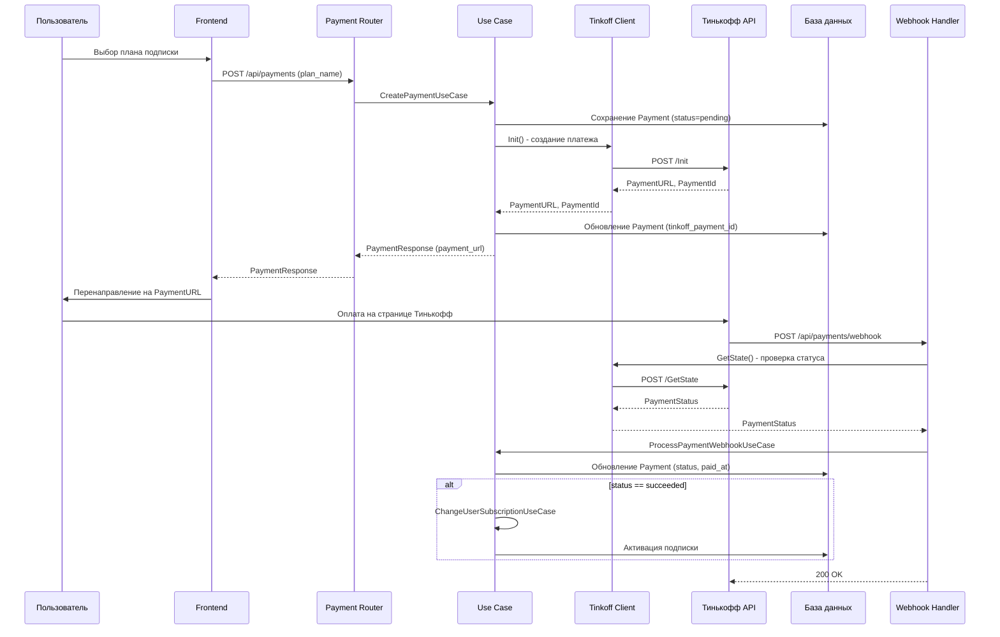

# План подключения Тинькофф эквайринга

## Обзор

Интеграция Тинькофф эквайринга для обработки платежей за подписки. Реализация включает создание клиента для работы с API Тинькофф, доменных сущностей для платежей, use cases для бизнес-логики, роутера для API эндпоинтов и миграций БД.

## Архитектура решения

### Компоненты

1. **TinkoffAcquiringClient** (`backend/infrastructure/clients/tinkoff_acquiring_client.py`) - HTTP клиент для работы с API Тинькофф эквайринга
2. **Payment Entity** (`backend/domain/entities/payment.py`) - доменная сущность платежа
3. **Payment Model** (`backend/infrastructure/database/models/payment_model.py`) - SQLAlchemy модель для БД
4. **Payment Repository** - интерфейс и реализация репозитория платежей
5. **Payment Use Cases** - бизнес-логика создания и обработки платежей
6. **Payment Router** (`backend/presentation/routers/payment_router.py`) - FastAPI роутер для эндпоинтов
7. **Payment DTOs** - DTO для запросов и ответов API
8. **Миграция БД** - создание таблицы payments

### Поток данных



## Детальный план реализации

### 1. Конфигурация

**Файл:** `backend/config.py`

Добавить класс `TinkoffAcquiringConfig`:

- `terminal_key: str` - TerminalKey из личного кабинета Тинькофф
- `secret_key: str` - SecretKey для подписи запросов
- `base_url: str` - URL API (тестовый/продакшн)
- `is_test: bool` - флаг тестового режима

Добавить в `AppConfig` поле `tinkoff: TinkoffAcquiringConfig`.

Загрузка из переменных окружения:

- `TINKOFF_TERMINAL_KEY`
- `TINKOFF_SECRET_KEY`
- `TINKOFF_IS_TEST` (по умолчанию True)
- `TINKOFF_BASE_URL` (опционально, по умолчанию зависит от is_test)

### 2. Доменная модель

**Файл:** `backend/domain/entities/payment.py`

Создать enum `PaymentStatus`:

- `PENDING` - платеж создан, ожидает оплаты
- `SUCCEEDED` - платеж успешно оплачен
- `CANCELED` - платеж отменен
- `REJECTED` - платеж отклонен

Создать dataclass `Payment`:

- `id: UUID` - внутренний ID платежа
- `user_id: UUID` - пользователь
- `subscription_plan_id: UUID` - план подписки
- `tinkoff_payment_id: str | None` - ID платежа в Тинькофф
- `amount: Decimal` - сумма платежа
- `currency: str` - валюта (RUB)
- `status: PaymentStatus` - статус платежа
- `created_at: datetime` - время создания
- `paid_at: datetime | None` - время оплаты
- `description: str | None` - описание платежа

### 3. Интерфейс репозитория

**Файл:** `backend/domain/interfaces/payment_repository_port.py`

Создать абстрактный класс `PaymentRepositoryPort` с методами:

- `get_by_id(payment_id: UUID) -> Payment | None`
- `get_by_tinkoff_id(tinkoff_payment_id: str) -> Payment | None`
- `create(payment: Payment) -> Payment`
- `update(payment: Payment) -> Payment`
- `get_by_user_id(user_id: UUID) -> List[Payment]`

### 4. SQLAlchemy модель

**Файл:** `backend/infrastructure/database/models/payment_model.py`

Создать модель `PaymentModel`:

- Таблица `payments`
- Поля соответствуют доменной сущности
- Индексы на `user_id`, `tinkoff_payment_id`, `status`
- Foreign keys на `users` и `subscription_plans`

### 5. Реализация репозитория

**Файл:** `backend/infrastructure/database/repositories/payment_repository.py`

Реализовать `PaymentRepository`:

- Наследование от `BaseRepository` и `PaymentRepositoryPort`
- Методы `_to_domain()` и `_to_model()` для конвертации
- Все методы из интерфейса

### 6. Интеграция в UnitOfWork

**Файл:** `backend/infrastructure/database/unit_of_work.py`

Добавить:

- Поле `_payment_repository: PaymentRepositoryPort | None`
- Property `payment_repository` с ленивой инициализацией
- Метод `standalone_payment_repository()`
- Инициализацию в `__enter__()`

**Файл:** `backend/domain/interfaces/unit_of_work_port.py`

Добавить в интерфейс `UnitOfWorkPort`:

- Property `payment_repository: PaymentRepositoryPort`

### 7. Клиент Тинькофф API

**Файл:** `backend/infrastructure/clients/tinkoff_acquiring_client.py`

Создать класс `TinkoffAcquiringClient`:

- Инициализация с `TinkoffAcquiringConfig`
- Метод `_generate_token(data: dict) -> str` - генерация токена для подписи запросов (MD5)
- Метод `_make_request(method: str, data: dict) -> dict` - общий метод для запросов
- Метод `init(amount: Decimal, order_id: str, description: str, success_url: str, fail_url: str) -> dict` - создание платежа
- Метод `get_state(payment_id: str) -> dict` - получение статуса платежа
- Метод `cancel(payment_id: str, amount: Decimal | None) -> dict` - отмена платежа

**Особенности:**

- Использовать `httpx.AsyncClient` для асинхронных запросов
- Базовая обработка ошибок и логирование
- Валидация ответов от API

### 8. Use Cases

**Файл:** `backend/domain/use_cases/create_payment.py`

Создать `CreatePaymentUseCase`:

- Входные параметры: `user_id`, `plan_name`
- Получить план подписки из репозитория
- Создать доменную сущность `Payment` со статусом `PENDING`
- Сохранить в БД
- Вызвать `TinkoffAcquiringClient.init()` для создания платежа в Тинькофф
- Обновить `Payment` с `tinkoff_payment_id` и `payment_url`
- Вернуть `Payment` с `payment_url`

**Файл:** `backend/domain/use_cases/process_payment_webhook.py`

Создать `ProcessPaymentWebhookUseCase`:

- Входные параметры: `tinkoff_payment_id`, `status` из webhook
- Получить `Payment` по `tinkoff_payment_id`
- Вызвать `TinkoffAcquiringClient.get_state()` для проверки статуса
- Обновить `Payment` (status, paid_at)
- Если статус `SUCCEEDED`:
  - Вызвать `ChangeUserSubscriptionUseCase` для активации подписки
- Вернуть обновленный `Payment`

**Файл:** `backend/domain/use_cases/get_payment_status.py`

Создать `GetPaymentStatusUseCase`:

- Входные параметры: `payment_id`, `user_id` (для проверки прав)
- Получить `Payment` из репозитория
- Проверить, что платеж принадлежит пользователю
- Вернуть `Payment`

### 9. DTO

**Файл:** `backend/presentation/dto/payment_request.py`

Создать `CreatePaymentRequest`:

- `plan_name: str` - название плана подписки

**Файл:** `backend/presentation/dto/payment_response.py`

Создать:

- `PaymentResponse` - полная информация о платеже
- `CreatePaymentResponse` - ответ при создании (payment_id, payment_url, amount, currency)

### 10. Роутер

**Файл:** `backend/presentation/routers/payment_router.py`

Создать эндпоинты:

**POST /api/payments** - создание платежа

- Требует аутентификации
- Принимает `CreatePaymentRequest`
- Вызывает `CreatePaymentUseCase`
- Возвращает `CreatePaymentResponse`

**GET /api/payments/{payment_id}** - получение статуса платежа

- Требует аутентификации
- Проверяет, что платеж принадлежит пользователю
- Вызывает `GetPaymentStatusUseCase`
- Возвращает `PaymentResponse`

**POST /api/payments/webhook** - обработка webhook от Тинькофф

- Не требует аутентификации (проверка подписи)
- Принимает JSON от Тинькофф
- Валидация подписи запроса
- Вызывает `ProcessPaymentWebhookUseCase`
- Возвращает 200 OK

**GET /api/payments/success** - страница успешной оплаты

- Не требует аутентификации
- Query параметр `payment_id` или `OrderId` от Тинькофф
- Перенаправление на фронтенд с информацией о платеже

**GET /api/payments/fail** - страница ошибки оплаты

- Не требует аутентификации
- Query параметр `payment_id` или `OrderId`
- Перенаправление на фронтенд с информацией об ошибке

### 11. Миграция БД

**Файл:** `backend/alembic/versions/XXXX_add_payments_table.py`

Создать миграцию:

- Таблица `payments` с полями:
  - `id UUID PRIMARY KEY`
  - `user_id UUID NOT NULL REFERENCES users(id) ON DELETE CASCADE`
  - `subscription_plan_id UUID NOT NULL REFERENCES subscription_plans(id) ON DELETE RESTRICT`
  - `tinkoff_payment_id VARCHAR(255) UNIQUE`
  - `amount DECIMAL(10, 2) NOT NULL`
  - `currency VARCHAR(3) NOT NULL DEFAULT 'RUB'`
  - `status VARCHAR(20) NOT NULL`
  - `description TEXT`
  - `created_at TIMESTAMP WITH TIME ZONE NOT NULL DEFAULT NOW()`
  - `paid_at TIMESTAMP WITH TIME ZONE`
- Индексы на `user_id`, `tinkoff_payment_id`, `status`, `created_at`

### 12. Интеграция в приложение

**Файл:** `backend/presentation/app.py`

Добавить импорт и подключение роутера:

```python
from presentation.routers.payment_router import router as payment_router
app.include_router(payment_router)
```

### 13. Валидация webhook

**В `ProcessPaymentWebhookUseCase` или отдельном сервисе:**

Реализовать проверку подписи webhook от Тинькофф:

- Получить `Token` из запроса
- Сформировать строку для подписи согласно документации Тинькофф
- Вычислить MD5 хеш
- Сравнить с `Token` из запроса
- Если не совпадает - вернуть ошибку

### 14. Обработка ошибок

Добавить обработку ошибок:

- Ошибки API Тинькофф (сетевая ошибка, таймаут, неверный ответ)
- Ошибки валидации (неверная сумма, несуществующий план)
- Ошибки бизнес-логики (план уже активен, платеж уже обработан)
- Логирование всех ошибок через `loguru`

### 15. Тестирование

**Рекомендации:**

- Использовать тестовый режим Тинькофф для разработки
- Тестовые карты для проверки успешных и неуспешных платежей
- Проверка webhook в тестовом режиме
- Интеграционные тесты для основных сценариев

## Переменные окружения

Добавить в `.env`:

```
TINKOFF_TERMINAL_KEY=your_terminal_key
TINKOFF_SECRET_KEY=your_secret_key
TINKOFF_IS_TEST=true
TINKOFF_BASE_URL=https://securepay.tinkoff.ru/v2  # для продакшн
# или https://rest-api-test.tinkoff.ru/v2  # для теста
```

## Зависимости

Проверить наличие в `requirements.txt`:

- `httpx` - уже есть
- `cryptography` - уже есть (для MD5, но можно использовать встроенный `hashlib`)

## Порядок выполнения

1. Конфигурация и переменные окружения
2. Доменная модель (Payment entity, PaymentStatus enum)
3. Интерфейс репозитория
4. SQLAlchemy модель и миграция
5. Реализация репозитория
6. Интеграция в UnitOfWork
7. Клиент Тинькофф API
8. Use Cases
9. DTO
10. Роутер
11. Интеграция в приложение
12. Тестирование

## Дополнительные соображения

- **Безопасность**: Всегда проверять подпись webhook, не доверять данным от клиента
- **Идемпотентность**: Обработка повторных webhook с одинаковым статусом
- **Мониторинг**: Логирование всех операций с платежами
- **Retry логика**: При ошибках API Тинькофф можно добавить повторные попытки
- **Уведомления**: После успешной оплаты можно отправлять уведомления пользователю (email, Telegram)