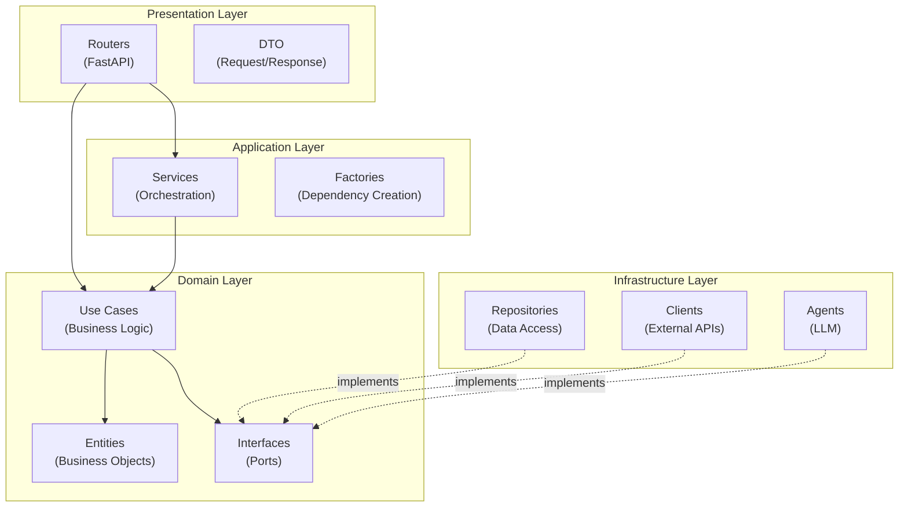

# Чистая архитектура

Описание принципов Clean Architecture и их применения в проекте "Вкатился".

## Принципы Clean Architecture

Clean Architecture (Чистая архитектура) — это подход к проектированию программного обеспечения, который разделяет систему на слои с четкими правилами зависимостей.

### Основные принципы

1. **Независимость от фреймворков** — бизнес-логика не зависит от внешних библиотек
2. **Тестируемость** — бизнес-логика может быть протестирована без UI, БД, веб-сервера
3. **Независимость от UI** — UI можно легко заменить без изменения бизнес-логики
4. **Независимость от БД** — можно заменить PostgreSQL на другую БД
5. **Независимость от внешних сервисов** — бизнес-правила не знают о внешнем мире

## Применение в проекте

### Разделение на слои



### Правила зависимостей

1. **Domain слой** — не зависит ни от чего
   - Содержит только бизнес-логику
   - Не знает о FastAPI, SQLAlchemy, HTTP клиентах

2. **Infrastructure слой** — зависит только от Domain
   - Реализует интерфейсы из Domain
   - Не может вызывать Use Cases или Services

3. **Application слой** — зависит только от Domain
   - Оркестрирует Use Cases
   - Не зависит от Infrastructure напрямую

4. **Presentation слой** — зависит от Domain и Application
   - Использует Use Cases и Services
   - Преобразует DTO ↔ Entity

### Поток зависимостей

```
Presentation → Application → Domain ← Infrastructure
```

Все зависимости направлены **внутрь**, к Domain слою.

## Преимущества подхода

### 1. Тестируемость

Бизнес-логика (Use Cases) может быть протестирована без реальной БД или HTTP клиентов:

```python
# Use Case не зависит от конкретной реализации
class CreateResumeUseCase:
    def __init__(self, resume_repository: ResumeRepositoryPort):
        self._repository = resume_repository  # Интерфейс, не реализация
    
    async def execute(self, user_id: UUID, content: str):
        # Бизнес-логика
        resume = Resume(user_id=user_id, content=content)
        return await self._repository.create(resume)

# В тестах можно использовать моки
mock_repository = MockResumeRepository()
use_case = CreateResumeUseCase(mock_repository)
```

### 2. Гибкость

Можно легко заменить реализации:

- Заменить PostgreSQL на MongoDB — изменить только Infrastructure
- Заменить FastAPI на Flask — изменить только Presentation
- Добавить новый способ аутентификации — добавить реализацию интерфейса

### 3. Независимость от фреймворков

Бизнес-логика не знает о FastAPI:

```python
# Domain слой не импортирует FastAPI
from domain.entities.resume import Resume  # ✅ OK
from fastapi import FastAPI  # ❌ НЕ ДОПУСТИМО в Domain
```

### 4. Читаемость

Четкое разделение ответственности делает код понятнее:

- **Domain** — что делает система (бизнес-правила)
- **Application** — как оркестрируются операции
- **Infrastructure** — как реализуются технические детали
- **Presentation** — как система взаимодействует с внешним миром

## Примеры из кода

### Правильная структура

```python
# Domain/entities/resume.py
@dataclass
class Resume:
    id: UUID
    user_id: UUID
    content: str

# Domain/interfaces/resume_repository_port.py
class ResumeRepositoryPort(ABC):
    @abstractmethod
    async def create(self, resume: Resume) -> Resume:
        pass

# Infrastructure/database/repositories/resume_repository.py
class ResumeRepository(ResumeRepositoryPort):
    async def create(self, resume: Resume) -> Resume:
        # Реализация с SQLAlchemy
        pass

# Domain/use_cases/create_resume.py
class CreateResumeUseCase:
    def __init__(self, repository: ResumeRepositoryPort):
        self._repository = repository  # Интерфейс!
```

### Неправильная структура

```python
# ❌ НЕПРАВИЛЬНО: Domain зависит от Infrastructure
from infrastructure.database.repositories.resume_repository import ResumeRepository

class CreateResumeUseCase:
    def __init__(self):
        self._repository = ResumeRepository()  # Конкретная реализация
```

## Связанные разделы

- [Описание слоев](layers.md) — детальное описание каждого слоя
- [Паттерны проектирования](patterns.md) — используемые паттерны
- [Development: Добавление фич](../development/adding-features.md) — как разрабатывать по этой архитектуре
