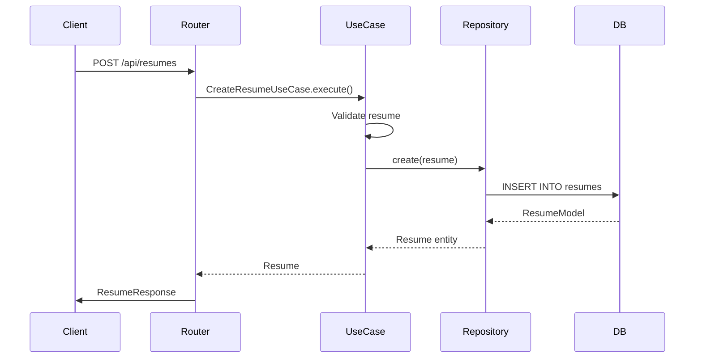
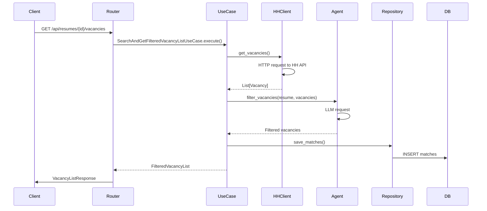
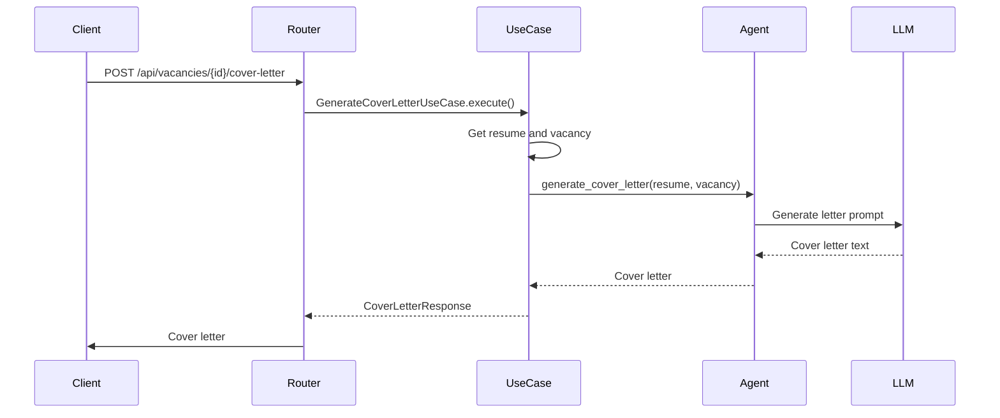
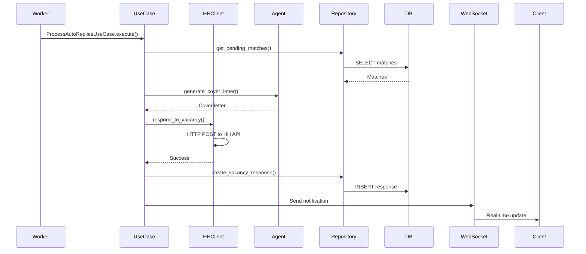
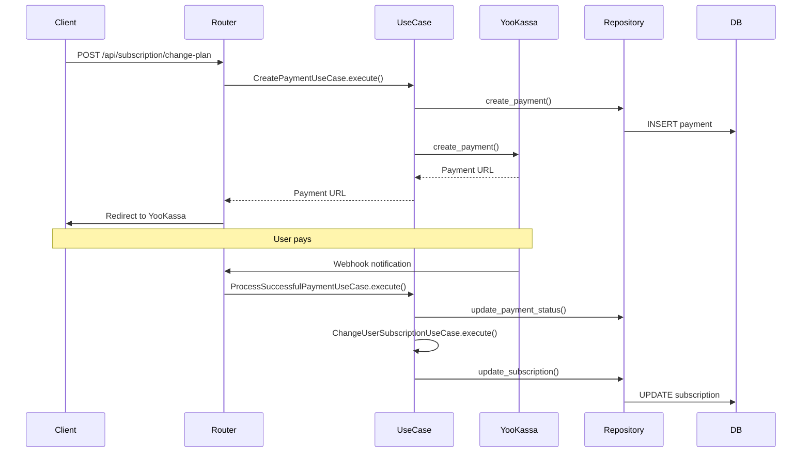
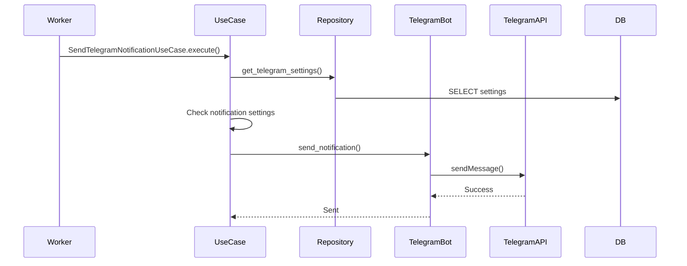
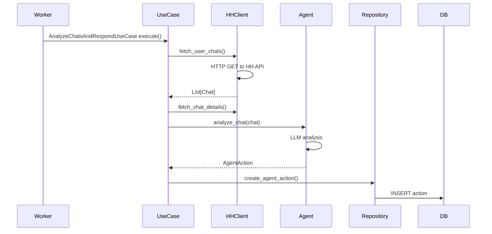

# Потоки данных

Описание основных потоков данных в системе "Вкатился".

## Создание резюме

## Поиск и фильтрация вакансий

## Генерация сопроводительного письма

## Автоотклик на вакансию

## Обработка платежа

## Отправка Telegram уведомления

## Анализ чатов

## Связанные разделы

- [Архитектура слоев](layers.md) — описание слоев
- [Доменная модель](domain-model.md) — сущности
