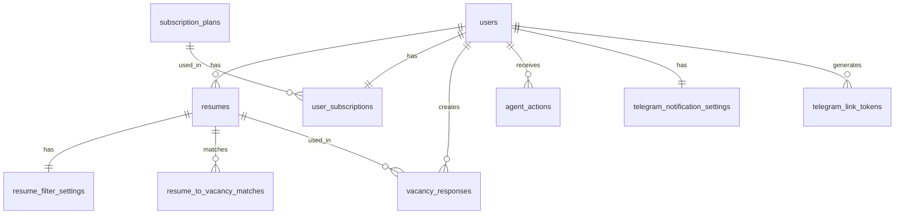

# Схема базы данных

Описание структуры базы данных проекта "Вкатился".

## Обзор

База данных использует **PostgreSQL 16** и управляется через **Alembic** миграции.

## Основные таблицы

### users

**Назначение:** Пользователи системы.

**Поля:**
- `id` (UUID, PK) — уникальный идентификатор
- `email` (VARCHAR, UNIQUE) — email адрес
- `hashed_password` (VARCHAR) — хешированный пароль
- `is_active` (BOOLEAN) — активен ли пользователь
- `is_superuser` (BOOLEAN) — администратор
- `is_verified` (BOOLEAN) — верифицирован ли email
- `resume_id` (VARCHAR) — ID резюме в HH
- `area` (VARCHAR) — регион
- `salary` (VARCHAR) — желаемая зарплата
- `hh_user_id` (VARCHAR) — ID пользователя в HH
- `hh_headers` (JSONB) — заголовки для HH API
- `hh_cookies` (JSONB) — куки для HH API
- `hh_cookies_updated_at` (TIMESTAMP) — время обновления кук
- `phone` (VARCHAR) — телефон
- `created_at` (TIMESTAMP) — время создания
- `updated_at` (TIMESTAMP) — время обновления

**Индексы:**
- `ix_users_email` — на email

### resumes

**Назначение:** Резюме пользователей.

**Поля:**
- `id` (UUID, PK)
- `user_id` (UUID, FK → users.id)
- `content` (TEXT) — текст резюме
- `user_parameters` (TEXT) — параметры фильтрации
- `external_id` (VARCHAR) — ID в HH
- `headhunter_hash` (VARCHAR) — хеш резюме
- `is_auto_reply` (BOOLEAN) — автоотклики включены
- `autolike_threshold` (INTEGER) — порог для автооткликов
- `created_at` (TIMESTAMP)
- `updated_at` (TIMESTAMP)

**Индексы:**
- `ix_resumes_user_id` — на user_id

### subscription_plans

**Назначение:** Тарифные планы подписки.

**Поля:**
- `id` (UUID, PK)
- `name` (VARCHAR, UNIQUE) — название (FREE, PLAN_1, etc.)
- `response_limit` (INTEGER) — лимит откликов
- `reset_period_seconds` (INTEGER) — период сброса
- `duration_days` (INTEGER) — срок действия
- `price` (NUMERIC(10,2)) — цена
- `is_active` (BOOLEAN) — активен ли план

**Индексы:**
- `ix_subscription_plans_name` — на name

### user_subscriptions

**Назначение:** Подписки пользователей.

**Поля:**
- `user_id` (UUID, PK, FK → users.id)
- `subscription_plan_id` (UUID, FK → subscription_plans.id)
- `responses_count` (INTEGER) — использовано откликов
- `period_started_at` (TIMESTAMP) — начало периода
- `started_at` (TIMESTAMP) — начало подписки
- `expires_at` (TIMESTAMP) — окончание подписки

**Индексы:**
- `ix_user_subscriptions_subscription_plan_id` — на subscription_plan_id

### vacancy_responses

**Назначение:** Отклики на вакансии.

**Поля:**
- `id` (UUID, PK)
- `user_id` (UUID, FK → users.id)
- `resume_id` (UUID, FK → resumes.id)
- `vacancy_id` (VARCHAR) — ID вакансии в HH
- `vacancy_name` (VARCHAR) — название вакансии
- `vacancy_url` (VARCHAR) — URL вакансии
- `cover_letter` (TEXT) — сопроводительное письмо
- `resume_hash` (VARCHAR) — хеш резюме
- `created_at` (TIMESTAMP)

**Индексы:**
- `ix_vacancy_responses_user_id` — на user_id
- `ix_vacancy_responses_resume_id` — на resume_id
- `ix_vacancy_responses_vacancy_id` — на vacancy_id

### resume_to_vacancy_matches

**Назначение:** Совпадения резюме с вакансиями.

**Поля:**
- `id` (UUID, PK)
- `resume_id` (UUID, FK → resumes.id)
- `vacancy_id` (VARCHAR) — ID вакансии
- `match_score` (INTEGER) — оценка совпадения
- `created_at` (TIMESTAMP)

**Индексы:**
- `ix_resume_to_vacancy_matches_resume_id` — на resume_id

### agent_actions

**Назначение:** Действия, предложенные AI агентом.

**Поля:**
- `id` (UUID, PK)
- `user_id` (UUID, FK → users.id)
- `entity_type` (VARCHAR) — тип сущности
- `entity_id` (BIGINT) — ID сущности
- `action_type` (VARCHAR) — тип действия
- `action_data` (JSONB) — данные действия
- `is_read` (BOOLEAN) — прочитано ли
- `created_at` (TIMESTAMP)

**Индексы:**
- `ix_agent_actions_user_id` — на user_id
- `ix_agent_actions_is_read` — на is_read

### resume_filter_settings

**Назначение:** Настройки фильтрации для резюме.

**Поля:**
- `id` (UUID, PK)
- `resume_id` (UUID, FK → resumes.id, UNIQUE)
- `salary_min` (INTEGER) — минимальная зарплата
- `area` (VARCHAR) — регион
- `keywords` (TEXT) — ключевые слова
- `stop_words` (TEXT) — стоп-слова
- `excluded_companies` (TEXT) — исключаемые компании
- `created_at` (TIMESTAMP)
- `updated_at` (TIMESTAMP)

### telegram_notification_settings

**Назначение:** Настройки Telegram уведомлений.

**Поля:**
- `id` (UUID, PK)
- `user_id` (UUID, FK → users.id, UNIQUE)
- `telegram_chat_id` (BIGINT) — ID чата в Telegram
- `telegram_username` (VARCHAR) — username в Telegram
- `is_enabled` (BOOLEAN) — включены ли уведомления
- `notify_new_messages` (BOOLEAN) — уведомления о сообщениях
- `notify_invitations` (BOOLEAN) — уведомления о приглашениях
- `notify_rejections` (BOOLEAN) — уведомления об отказах
- `created_at` (TIMESTAMP)
- `updated_at` (TIMESTAMP)

### telegram_link_tokens

**Назначение:** Временные токены для привязки Telegram.

**Поля:**
- `id` (UUID, PK)
- `user_id` (UUID, FK → users.id)
- `token` (VARCHAR, UNIQUE) — токен
- `expires_at` (TIMESTAMP) — срок действия
- `created_at` (TIMESTAMP)

**Индексы:**
- `ix_telegram_link_tokens_token` — на token

## ER-диаграмма



## Миграции

Миграции находятся в `backend/alembic/versions/` и управляются через Alembic.

### Применение миграций

```bash
cd backend
alembic upgrade head
```

### Создание новой миграции

```bash
alembic revision --autogenerate -m "description"
```

## Связанные разделы

- [Доменная модель](domain-model.md) — бизнес-сущности
- [Reference: Таблицы БД](../reference/database-tables.md) — детальное описание
