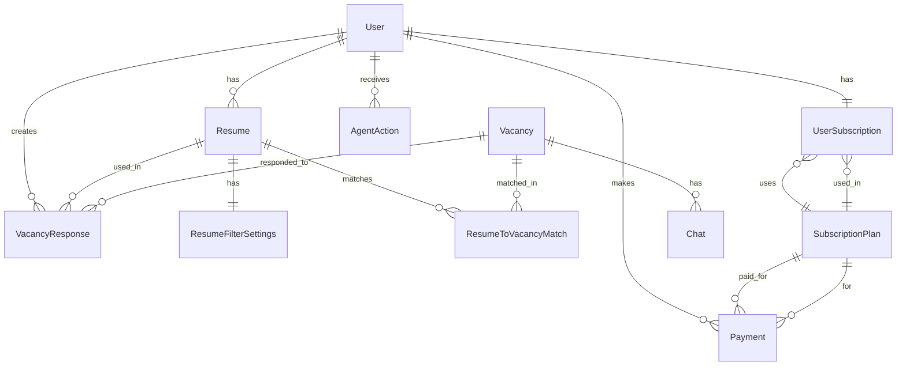

# Доменная модель

Описание доменных сущностей и их связей в проекте "AutoOffer".

## Основные сущности

### User (Пользователь)

**Описание:** Пользователь системы.

**Поля:**
- `id` (UUID) — уникальный идентификатор
- `email` (str) — email адрес
- `hashed_password` (str) — хешированный пароль
- `is_active` (bool) — активен ли пользователь
- `is_superuser` (bool) — является ли администратором
- `resume_id` (str | None) — ID резюме в HeadHunter
- `area` (str | None) — регион поиска
- `salary` (str | None) — желаемая зарплата

**Связи:**
- Имеет множество `Resume`
- Имеет одну `UserSubscription`
- Имеет множество `VacancyResponse`
- Имеет `TelegramNotificationSettings`

### Resume (Резюме)

**Описание:** Резюме пользователя.

**Поля:**
- `id` (UUID) — уникальный идентификатор
- `user_id` (UUID) — владелец резюме
- `content` (str) — текст резюме
- `user_parameters` (str | None) — дополнительные параметры
- `external_id` (str | None) — ID в HeadHunter
- `headhunter_hash` (str | None) — хеш резюме в HH
- `is_auto_reply` (bool) — включены ли автоотклики
- `autolike_threshold` (int) — порог для автооткликов

**Связи:**
- Принадлежит `User`
- Имеет `ResumeFilterSettings`
- Имеет множество `ResumeToVacancyMatch`
- Имеет множество `VacancyResponse`

**Бизнес-правила:**
- Резюме должно иметь непустой `content`
- `autolike_threshold` должен быть в диапазоне 0-100

### Vacancy (Вакансия)

**Описание:** Вакансия с HeadHunter.

**Поля:**
- `id` (str) — ID вакансии в HH
- `name` (str) — название вакансии
- `url` (str) — URL вакансии
- `salary` (dict | None) — информация о зарплате
- `employer` (dict) — информация о работодателе
- `area` (dict) — регион
- `description` (str) — описание вакансии
- И другие поля из API HH

**Связи:**
- Имеет множество `ResumeToVacancyMatch`
- Имеет множество `VacancyResponse`

### VacancyResponse (Отклик на вакансию)

**Описание:** Отклик пользователя на вакансию.

**Поля:**
- `id` (UUID) — уникальный идентификатор
- `user_id` (UUID) — пользователь
- `resume_id` (UUID) — использованное резюме
- `vacancy_id` (str) — ID вакансии
- `vacancy_name` (str) — название вакансии
- `vacancy_url` (str) — URL вакансии
- `cover_letter` (str | None) — сопроводительное письмо
- `created_at` (datetime) — время создания
- `resume_hash` (str | None) — хеш резюме на момент отклика

**Связи:**
- Принадлежит `User`
- Принадлежит `Resume`
- Связана с `Vacancy`

### SubscriptionPlan (План подписки)

**Описание:** Тарифный план подписки.

**Поля:**
- `id` (UUID) — уникальный идентификатор
- `name` (str) — название плана (FREE, PLAN_1, PLAN_2, PLAN_3)
- `response_limit` (int) — лимит откликов за период
- `reset_period_seconds` (int) — период сброса лимита (в секундах)
- `duration_days` (int) — срок действия подписки (0 = бессрочно)
- `price` (Decimal) — цена плана
- `is_active` (bool) — активен ли план

**Связи:**
- Имеет множество `UserSubscription`

**Бизнес-правила:**
- FREE план всегда имеет `price = 0`
- `response_limit` должен быть > 0
- `reset_period_seconds` должен быть > 0

### UserSubscription (Подписка пользователя)

**Описание:** Текущая подписка пользователя.

**Поля:**
- `user_id` (UUID) — пользователь
- `subscription_plan_id` (UUID) — план подписки
- `responses_count` (int) — количество использованных откликов
- `period_started_at` (datetime | None) — начало текущего периода
- `started_at` (datetime) — начало подписки
- `expires_at` (datetime | None) — окончание подписки

**Связи:**
- Принадлежит `User`
- Принадлежит `SubscriptionPlan`

**Бизнес-правила:**
- `responses_count` не может превышать `plan.response_limit`
- При истечении `expires_at` подписка переходит на FREE план
- При достижении `reset_period_seconds` счетчик сбрасывается

### Payment (Платеж)

**Описание:** Платеж за подписку.

**Поля:**
- `id` (UUID) — уникальный идентификатор
- `user_id` (UUID) — пользователь
- `subscription_plan_id` (UUID) — оплачиваемый план
- `yookassa_payment_id` (str) — ID платежа в ЮКассе
- `amount` (Decimal) — сумма платежа
- `currency` (str) — валюта (RUB)
- `status` (PaymentStatus) — статус платежа
- `created_at` (datetime) — время создания
- `paid_at` (datetime | None) — время оплаты

**Связи:**
- Принадлежит `User`
- Принадлежит `SubscriptionPlan`

**Бизнес-правила:**
- После успешной оплаты активируется подписка
- Платеж может быть отменен или возвращен

### AgentAction (Действие агента)

**Описание:** Действие, предложенное AI агентом.

**Поля:**
- `id` (UUID) — уникальный идентификатор
- `user_id` (UUID) — пользователь
- `entity_type` (str) — тип сущности (chat, vacancy)
- `entity_id` (str) — ID сущности
- `action_type` (str) — тип действия
- `action_data` (dict) — данные действия
- `is_read` (bool) — прочитано ли действие
- `created_at` (datetime) — время создания

**Связи:**
- Принадлежит `User`

### Chat (Чат)

**Описание:** Чат с работодателем в HeadHunter.

**Поля:**
- `id` (str) — ID чата в HH
- `vacancy_id` (str) — ID вакансии
- `employer_name` (str) — имя работодателя
- `last_message` (dict | None) — последнее сообщение
- `unread_count` (int) — количество непрочитанных сообщений

**Связи:**
- Связан с `Vacancy`
- Имеет множество `ChatMessage`

## Диаграмма связей

## Бизнес-правила

### Подписки

1. При регистрации пользователь получает FREE план
2. Платные планы имеют срок действия (`duration_days`)
3. При истечении срока подписка переходит на FREE
4. Лимит откликов сбрасывается через `reset_period_seconds`

### Отклики

1. Количество откликов ограничено лимитом подписки
2. При превышении лимита отклики блокируются
3. Отклик содержит резюме и сопроводительное письмо

### Резюме

1. Пользователь может иметь несколько резюме
2. Резюме можно импортировать из HeadHunter
3. Для каждого резюме настраиваются свои фильтры

## Связанные разделы

- [Схема базы данных](database-schema.md) — структура БД
- [Потоки данных](data-flow.md) — как данные проходят через систему
