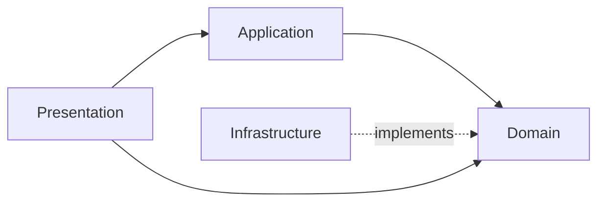
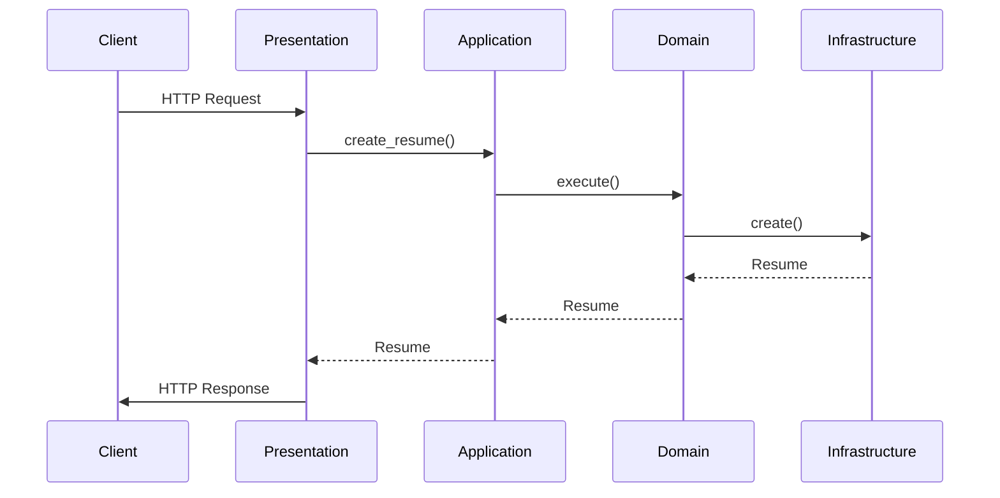

# Описание слоев

Детальное описание каждого слоя архитектуры проекта "AutoOffer".

## Обзор слоев



## Domain Layer (Слой домена)

**Путь:** `backend/domain/`

**Назначение:** Ядро приложения, содержит бизнес-логику и не зависит ни от чего.

### Структура

```
domain/
├── entities/          # Доменные сущности
├── interfaces/        # Порты (интерфейсы)
├── use_cases/        # Use Cases (бизнес-логика)
└── exceptions/       # Доменные исключения
```

### Entities (Сущности)

Доменные объекты, представляющие бизнес-концепции.

**Примеры:**
- `Resume` — резюме пользователя
- `User` — пользователь
- `Vacancy` — вакансия
- `SubscriptionPlan` — план подписки
- `Payment` — платеж

**Характеристики:**
- Не зависят от фреймворков
- Содержат только данные и базовую логику
- Не знают о БД или HTTP

**Пример:**

```python
# domain/entities/resume.py
@dataclass(slots=True)
class Resume:
    id: UUID
    user_id: UUID
    content: str
    user_parameters: str | None = None
    
    def is_valid(self) -> bool:
        """Проверка валидности резюме."""
        return len(self.content) > 0
```

### Interfaces (Порты)

Абстрактные интерфейсы для всего, что нужно из инфраструктуры.

**Примеры:**
- `ResumeRepositoryPort` — работа с резюме в БД
- `HHClientPort` — взаимодействие с HeadHunter API
- `LLMAgentPort` — работа с LLM

**Характеристики:**
- Определяют контракты, не реализации
- Используются в Use Cases
- Реализуются в Infrastructure

**Пример:**

```python
# domain/interfaces/resume_repository_port.py
class ResumeRepositoryPort(ABC):
    @abstractmethod
    async def create(self, resume: Resume) -> Resume:
        pass
    
    @abstractmethod
    async def get_by_id(self, resume_id: UUID) -> Resume | None:
        pass
```

### Use Cases

Единицы бизнес-логики, решающие конкретные задачи.

**Примеры:**
- `CreateResumeUseCase` — создание резюме
- `SearchAndGetFilteredVacancyListUseCase` — поиск и фильтрация вакансий
- `GenerateCoverLetterUseCase` — генерация сопроводительного письма

**Характеристики:**
- Принимают зависимости через конструктор (интерфейсы)
- Содержат бизнес-логику
- Могут вызывать другие Use Cases
- Не зависят от Infrastructure напрямую

**Пример:**

```python
# domain/use_cases/create_resume.py
class CreateResumeUseCase:
    def __init__(
        self,
        resume_repository: ResumeRepositoryPort,
    ):
        self._repository = resume_repository
    
    async def execute(self, user_id: UUID, content: str) -> Resume:
        # Бизнес-логика
        resume = Resume(
            id=uuid4(),
            user_id=user_id,
            content=content,
        )
        
        if not resume.is_valid():
            raise ValueError("Invalid resume")
        
        return await self._repository.create(resume)
```

### Exceptions

Доменные исключения для бизнес-ошибок.

**Примеры:**
- `SubscriptionLimitExceededError` — превышен лимит подписки
- `ResumeNotFoundError` — резюме не найдено

## Infrastructure Layer (Слой инфраструктуры)

**Путь:** `backend/infrastructure/`

**Назначение:** Реализация интерфейсов из Domain, работа с внешними системами.

### Структура

```
infrastructure/
├── database/          # Репозитории, модели, UnitOfWork
├── clients/           # HTTP клиенты
├── agents/            # LLM агенты
├── telegram/          # Telegram бот
├── websocket/         # WebSocket менеджер
└── auth/              # Аутентификация
```

### Database

**Репозитории** — реализация интерфейсов для работы с БД.

```python
# infrastructure/database/repositories/resume_repository.py
class ResumeRepository(ResumeRepositoryPort):
    def __init__(self, session: AsyncSession):
        self._session = session
    
    async def create(self, resume: Resume) -> Resume:
        model = ResumeModel.from_entity(resume)
        self._session.add(model)
        await self._session.flush()
        return model.to_entity()
```

**Модели** — SQLAlchemy модели для маппинга с БД.

```python
# infrastructure/database/models/resume_model.py
class ResumeModel(Base):
    __tablename__ = "resumes"
    
    id: Mapped[UUID] = mapped_column(primary_key=True)
    user_id: Mapped[UUID] = mapped_column(ForeignKey("users.id"))
    content: Mapped[str] = mapped_column(Text)
```

**UnitOfWork** — управление транзакциями.

```python
# infrastructure/database/unit_of_work.py
class UnitOfWork(UnitOfWorkPort):
    async def __aenter__(self):
        self._session = self._session_factory()
        return self
    
    async def commit(self):
        await self._session.commit()
```

### Clients

HTTP клиенты для внешних API.

```python
# infrastructure/clients/hh_client.py
class HHHttpClient(HHClientPort):
    def __init__(self, base_url: str):
        self._base_url = base_url
        self._client = httpx.AsyncClient()
    
    async def get_vacancies(self, params: dict) -> list[Vacancy]:
        response = await self._client.get(f"{self._base_url}/vacancies", params=params)
        return parse_vacancies(response.json())
```

### Agents

LLM агенты для работы с AI.

```python
# infrastructure/agents/vacancy_filter_agent.py
class VacancyFilterAgent(LLMAgentPort):
    async def filter_vacancies(
        self,
        resume: Resume,
        vacancies: list[Vacancy],
    ) -> list[Vacancy]:
        # Логика фильтрации через LLM
        pass
```

## Application Layer (Слой приложения)

**Путь:** `backend/application/`

**Назначение:** Оркестрация Use Cases, управление транзакциями.

### Структура

```
application/
├── services/          # Сервисы, оркестрирующие use cases
└── factories/         # Фабрики для создания зависимостей
```

### Services

Сервисы координируют несколько Use Cases.

```python
# application/services/resumes_service.py
class ResumesService:
    def __init__(self, unit_of_work: UnitOfWorkPort):
        self._unit_of_work = unit_of_work
    
    async def create_resume_with_evaluation(
        self,
        user_id: UUID,
        content: str,
    ) -> tuple[Resume, ResumeEvaluation]:
        async with self._unit_of_work:
            # Создание резюме
            create_uc = CreateResumeUseCase(
                self._unit_of_work.resume_repository
            )
            resume = await create_uc.execute(user_id, content)
            
            # Оценка резюме
            evaluate_uc = EvaluateResumeUseCase(...)
            evaluation = await evaluate_uc.execute(resume)
            
            await self._unit_of_work.commit()
            return resume, evaluation
```

### Factories

Фабрики создают сложные зависимости.

```python
# application/factories/database_factory.py
def create_unit_of_work(config: DatabaseConfig) -> UnitOfWorkPort:
    session_factory = create_session_factory(config)
    return UnitOfWork(session_factory)
```

## Presentation Layer (Слой представления)

**Путь:** `backend/presentation/`

**Назначение:** Входная точка приложения, обработка HTTP запросов.

### Структура

```
presentation/
├── routers/           # FastAPI роутеры
├── dto/               # DTO для запросов/ответов
└── dependencies.py    # FastAPI dependencies
```

### Routers

FastAPI роутеры обрабатывают HTTP запросы.

```python
# presentation/routers/resumes_router.py
router = APIRouter(prefix="/api/resumes", tags=["resumes"])

@router.post("", response_model=ResumeResponse)
async def create_resume(
    request: CreateResumeRequest,
    current_user: UserModel = Depends(get_current_active_user),
    unit_of_work: UnitOfWorkPort = Depends(get_unit_of_work),
):
    # Создание Use Case
    use_case = CreateResumeUseCase(
        unit_of_work.resume_repository
    )
    
    # Выполнение
    resume = await use_case.execute(
        current_user.id,
        request.content
    )
    
    # Преобразование Entity → DTO
    return ResumeResponse.from_entity(resume)
```

### DTO

Data Transfer Objects для API.

```python
# presentation/dto/resume_request.py
class CreateResumeRequest(BaseModel):
    content: str
    user_parameters: str | None = None

# presentation/dto/resume_response.py
class ResumeResponse(BaseModel):
    id: UUID
    user_id: UUID
    content: str
    
    @classmethod
    def from_entity(cls, resume: Resume) -> "ResumeResponse":
        return cls(
            id=resume.id,
            user_id=resume.user_id,
            content=resume.content,
        )
```

## Взаимодействие слоев



## Правила разработки

1. **Domain не импортирует Infrastructure или Presentation**
2. **Infrastructure реализует интерфейсы из Domain**
3. **Use Cases работают только с интерфейсами**
4. **Presentation преобразует DTO ↔ Entity**

## Связанные разделы

- [Чистая архитектура](clean-architecture.md) — принципы
- [Доменная модель](domain-model.md) — сущности
- [Паттерны проектирования](patterns.md) — используемые паттерны
